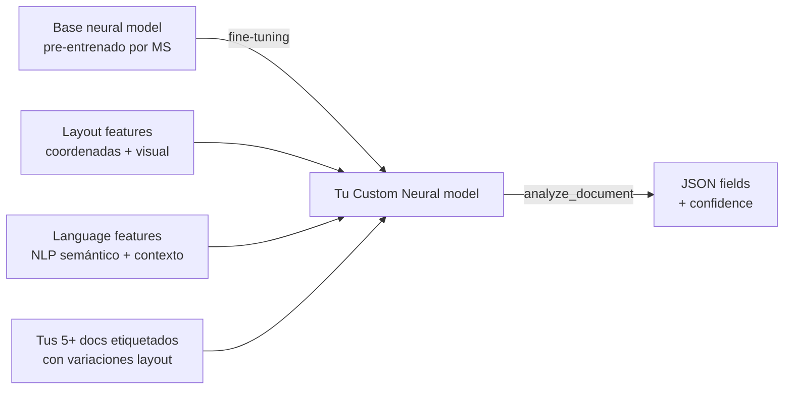

# Document Intelligence — Custom Neural model (v4.0 GA `2024-11-30`)

> [!warning] AI-102 carryover
> Este tema pertenece **íntegramente al temario AI-102** ("*Implement a custom document intelligence model*"). En **AI-103 Microsoft recomienda Content Understanding (CU) custom analyzers** para esquemas variables y multimodales. Custom Neural **sigue GA y plenamente soportado** y es la elección óptima cuando el ejercicio menciona: *"documentos con misma información pero diferentes layouts"* (ej. **W2 forms** de distintas empresas, facturas de múltiples proveedores con esquema común, contratos heterogéneos con cláusulas equivalentes). Si el examen menciona "layout fixed + ≥5 docs + training en minutos + bajo coste" → **[[extract-document-intelligence-custom-template|custom template]]**. Si menciona "layouts variados + deep learning + training en 30 min-12 h + signature/overlapping fields" → **custom neural**. Si menciona "schema flexible + multimodal + audio/video/imagen" → **[[extract-content-understanding-overview|CU custom analyzer]]**.

> [!abstract] TL;DR
> Custom Neural (también llamado "*custom document model*") es un modelo custom de Document Intelligence (servicio renombrado a **"Document Intelligence — Foundry Tools"**) basado en **deep learning** que **generaliza entre layouts**: documentos con la **misma información semántica** pero **distinta estructura visual** (W2 forms USA, facturas multi-vendor, contratos). A diferencia de [[extract-document-intelligence-custom-template|template]], NO depende de coordenadas fijas — usa **layout + language features** combinados. Mínimo de entrenamiento: **5 documentos etiquetados** (igual que template, según docs oficiales: *"You only need five examples to get started"*); en la **práctica** se recomienda **5 muestras por cada variación** de layout para que el modelo generalice. Training time: **30 minutos por defecto**, ampliable a **10 h (free)** o **12 h (paid)** en v4.0. Build mode: `buildMode: "neural"` (REST) / `DocumentBuildMode.NEURAL` (Python SDK `azure-ai-documentintelligence`). Cliente: `DocumentIntelligenceAdministrationClient.begin_build_document_model(BuildDocumentModelRequest(...))`. Soporta **signature detection**, **overlapping fields**, **tabular fields con table/row/cell confidence** (todo desde v4.0 `2024-11-30 GA`). Límites: **50.000 páginas máx / 1 GB training data total / 20 builds gratis al mes (v3.x) o 10 h gratis (v4.0)**. Para combinar varios neural → **composed model**. Para clasificar el tipo de doc antes → **custom classifier**.

## 🎯 Relevancia en el examen

🔥🔥 Tema **estable y muy preguntado en AI-102**; residual en AI-103. Tipos de pregunta:

- **Elegir Neural vs Template** dado un escenario (variabilidad de layout, número de documentos, tiempo/coste de training).
- **`buildMode` exacto**: valor literal `"neural"` (lowercase string en REST) / `DocumentBuildMode.NEURAL` (Python). Confundirlo con `"template"` es trampa frecuente.
- **Features exclusivas neural (v4.0)**: **signature detection**, **overlapping fields**, **table/row/cell confidence**. Template **NO** soporta overlapping fields.
- **Límites correctos**: 50.000 páginas neural vs 500 páginas template; 1 GB neural vs 50 MB template.
- **Training time real**: **30 min por defecto** (NO horas obligatorias). Paid training v4.0 permite hasta 10 h gratis + 12 h max.
- **Workflow**: subir a Storage → label en **Document Intelligence Studio** → genera `.labels.json` + `.ocr.json` + `fields.json` → `begin_build_document_model` con `build_mode=DocumentBuildMode.NEURAL` → poller `.result()` → test → analyze con `begin_analyze_document` (mismo API que prebuilt).
- **Regiones limitadas**: Custom neural training **solo** disponible en ~17 regiones específicas (East US, West US2, West Europe, etc.). **Trampa**: si la suscripción está en una región no soportada hay que **copiar el modelo** vía `copy-model-to` API.
- **Languages**: neural soporta menos idiomas que template (template soporta cualquiera de los `supported languages`; neural es lista reducida con inglés como principal).

## 📖 Concepto en profundidad

### 1. Qué es Custom Neural — naturaleza layout-flexible

Definición oficial verbatim:

> [!important] Documentación Microsoft
> *"Custom neural document models or neural models are a **deep learned model type that combines layout and language features** to accurately extract labeled fields from documents. The base custom neural model is **trained on various document types** that makes it suitable to be trained for **extracting fields from structured and semi-structured documents**."*
>
> *"Neural models support documents that have the **same information, but different page structures**. Examples of these documents include **United States W2 forms**, which share the same information, but can vary in appearance across companies."*

**Arquitectura conceptual**:



**Diferencia clave con template**:

| Aspecto | Template | Neural |
|---|---|---|
| Mecanismo base | Layout cues (coordenadas + anchors textuales) | Deep learning (layout + language combined) |
| Si el layout cambia | Accuracy se desploma | Generaliza |
| Si el wording cambia | Sigue funcionando si coords iguales | Sigue funcionando si semántica preservada |
| Idioma del field name | Cualquier idioma soportado | Inglés principalmente |
| Document structures | Structured (form) | **Structured, semi-structured, unstructured** |

### 2. Tipos de documentos soportados (oficial)

| Categoría | Ejemplos | Recomendación |
|---|---|---|
| **Structured** | Encuestas, cuestionarios | Neural ✅ (o template si layout idéntico) |
| **Semi-structured** | Facturas multi-vendor, purchase orders, recibos varios | **Neural ✅** (template falla con variantes) |
| **Unstructured** | Contratos, informes con prosa libre | Neural ✅ (template **no aplica**) |

### 3. Features soportadas (v4.0 GA `2024-11-30`)

| Feature | Custom Template | Custom Neural |
|---|---|---|
| Form fields (key-value pairs) | ✔ | ✔ |
| Selection marks (checkboxes, radio) | ✔ | ✔ |
| Tabular fields (tables) | ✔ | ✔ |
| Signature detection | ✔ | ✔ (desde v4.0) |
| Region labeling | ✔ (synthetic data at training) | ✔ (texto real reconocido en región) |
| **Overlapping fields** | ❌ n/a | ✅ (desde v4.0) |
| **Table/row/cell confidence** | Solo table-level | ✅ table + row + cell (desde v4.0) |
| Cross-page tables | ✔ | ✔ |

**Overlapping fields** (exclusivo neural v4.0): permite que **el mismo token pertenezca a 2 fields distintos** (ej. en una dirección completa, el código postal puede ser tanto parte de `full_address` como de `zip_code`). Requiere **region labeling** (no field selection) en el Studio.

### 4. Idiomas soportados

> [!warning] Limitación crítica de neural
> *"If the language of your documents and extraction scenarios supports custom neural models, we recommend that you use custom neural models over template models."* — implica que **no todos los idiomas están soportados por neural**.

Consultar siempre la página oficial [Language support — custom neural](https://learn.microsoft.com/en-us/azure/ai-services/document-intelligence/language-support/custom). **Trampa de examen**: si el escenario menciona un idioma exótico (ej. tailandés, hindi, hebreo) **template es la única opción**.

### 5. Regiones soportadas (training neural)

Solo estas regiones soportan **training** de custom neural (a fecha 18 octubre 2022, sin cambios hasta 2026-05):

- Australia East · Brazil South · Canada Central · Central India · Central US
- East Asia · East US · East US2 · France Central · Japan East
- South Central US · Southeast Asia · UK South · West Europe · West US2
- US Gov Arizona · US Gov Virginia

> [!tip] Workaround inter-región
> Si tu suscripción está en una región **no soportada** (ej. North Europe), entrena en una soportada y **copia el modelo** con `copy-model-to` REST API o vía Studio. El modelo copiado se puede usar en cualquier región.

### 6. Límites duros (críticos para examen)

| Límite | Neural | Template |
|---|---|---|
| Min docs training | 5 (oficial); ≥5 por variación recomendado | 5 |
| Max páginas training data | **50.000** | 500 |
| Total size training data | **1 GB** | 50 MB |
| File size analyze (S0) | 500 MB | 500 MB |
| File size analyze (F0) | 4 MB | 4 MB |
| Páginas/PDF analyze | 2.000 (F0: 2) | 2.000 |
| Training time default | 30 min | 1-5 min |
| Training time max v4.0 free | 10 h (free) | n/a |
| Training time max v4.0 paid | 12 h | n/a |
| Free builds/mes v3.x | 20 | 20 |
| Free training hours/mes v4.0 | 10 h | n/a |

### 7. Build mode — el switch decisivo

El `Build` operation soporta dos `buildMode` (v4.0 GA `2024-11-30`):

- `template` → activa el modelo layout-bound.
- `neural` → activa el modelo deep-learning.

**El campo se llama `buildMode` en REST y `build_mode` en Python SDK** (snake_case). En Python se usa el enum `DocumentBuildMode`:

| Enum value | REST string |
|---|---|
| `DocumentBuildMode.TEMPLATE` | `"template"` |
| `DocumentBuildMode.NEURAL` | `"neural"` |

> [!danger] Trampa de examen
> El enum **NO** tiene `GENERATIVE` ni `CUSTOM_NEURAL` ni `DOCUMENT`. Solo `TEMPLATE` y `NEURAL`. Si una pregunta ofrece `DocumentBuildMode.GENERATIVE` o `DocumentBuildMode.CUSTOM` → **incorrecto**.

### 8. Mismo formato de label que template

Custom neural **comparte el formato de labeling con custom template** (mismo `.labels.json` y `.ocr.json` por documento). Esto permite:

- Empezar entrenando un template con 5 docs (rápido) y luego **reentrenar como neural** con los mismos labels + más docs (sin re-etiquetar).
- Si el dataset etiquetado contiene **field types no soportados por neural** (ej. ciertos region labels antiguos), serán **ignorados** durante el training neural (no falla, simplemente los descarta).

## 🏗️ Cómo se hace (Portal / CLI / Bicep / Python SDK / REST)

### Paso 1 — Crear recurso Document Intelligence (Foundry Tools)

```bash
# Azure CLI — kind=FormRecognizer sigue siendo el identifier ARM (servicio renombrado pero kind legacy se mantiene)
az cognitiveservices account create \
  --name di-neural-demo \
  --resource-group rg-ai \
  --kind FormRecognizer \
  --sku S0 \
  --location eastus \
  --custom-domain di-neural-demo \
  --yes
```

> [!note] Kind ARM
> El servicio se llama **"Document Intelligence — Foundry Tools"** en el portal/Foundry, pero el `kind` ARM sigue siendo `FormRecognizer` (legacy preservado). También sirve `kind=AIServices` (multi-service) que incluye Document Intelligence.

### Paso 2 — Preparar storage container con dataset

```bash
# Container con docs + .labels.json + .ocr.json + fields.json
az storage container create --name training-data --account-name <storage>

# SAS URL con permisos read + list
az storage container generate-sas \
  --name training-data \
  --account-name <storage> \
  --permissions rl \
  --expiry 2026-12-31 \
  --https-only
```

### Paso 3 — Etiquetar en Document Intelligence Studio

URL: `https://formrecognizer.appliedai.azure.com/studio/customextraction/projects`

1. **Custom extraction models** → **Create a project**.
2. Conectar Storage account + container.
3. **Label fields** documento por documento (key-value, selection marks, tables, signatures, **region labels** para overlapping fields).
4. Studio genera por cada documento: `<file>.pdf.labels.json`, `<file>.pdf.ocr.json` + un global `fields.json`.
5. Click **Train** → elegir **Neural** como build mode → opcionalmente ajustar `maxTrainingHours`.

### Paso 4 — Build programático en Python SDK

> [!warning] SDK correcto
> Usar **`azure-ai-documentintelligence`** (no el legacy `azure-ai-formrecognizer`). El admin client se llama `DocumentIntelligenceAdministrationClient`.

```python
from azure.identity import DefaultAzureCredential
from azure.ai.documentintelligence import DocumentIntelligenceAdministrationClient
from azure.ai.documentintelligence.models import (
    BuildDocumentModelRequest,
    DocumentBuildMode,
    AzureBlobContentSource,
)

endpoint = "https://di-neural-demo.cognitiveservices.azure.com/"
admin = DocumentIntelligenceAdministrationClient(
    endpoint=endpoint,
    credential=DefaultAzureCredential(),
)

# Container SAS URL con permisos rl
container_sas_url = (
    "https://<storage>.blob.core.windows.net/training-data?<sas-token>"
)

poller = admin.begin_build_document_model(
    BuildDocumentModelRequest(
        model_id="my-neural-w2-model",
        description="W2 forms multi-employer (custom neural)",
        build_mode=DocumentBuildMode.NEURAL,   # <- la clave del archivo
        azure_blob_source=AzureBlobContentSource(
            container_url=container_sas_url,
            prefix="w2/",   # opcional, subcarpeta dentro del container
        ),
        # v4.0: paid training extension (opcional, default 30 min)
        max_training_hours=10,                  # hasta 10 h gratis v4.0
        # tags={"env": "prod", "version": "v1"} # metadata opcional
    )
)

# Operación long-running: tarda 30 min - 10 h según dataset
model_details = poller.result()
print(f"Model ID: {model_details.model_id}")
print(f"Training hours used: {model_details.training_hours}")
print(f"Doc types: {list(model_details.doc_types.keys())}")
```

### Paso 5 — Inferencing (mismo API que prebuilt)

```python
from azure.ai.documentintelligence import DocumentIntelligenceClient
from azure.ai.documentintelligence.models import AnalyzeDocumentRequest

di_client = DocumentIntelligenceClient(
    endpoint=endpoint,
    credential=DefaultAzureCredential(),
)

with open("w2_company_xyz.pdf", "rb") as f:
    poller = di_client.begin_analyze_document(
        model_id="my-neural-w2-model",  # tu custom neural ID
        body=AnalyzeDocumentRequest(bytes_source=f.read()),
    )
result = poller.result()

# Iterar documentos y fields
for doc in result.documents:
    print(f"Doc type: {doc.doc_type}  (overall confidence={doc.confidence})")
    for name, field in doc.fields.items():
        print(f"  {name} = {field.content!r}  (conf={field.confidence})")
        # v4.0: para tabular fields hay row/cell confidence
```

### Paso 6 — REST (training endpoint v4.0)

```http
POST https://{endpoint}/documentintelligence/documentModels:build?api-version=2024-11-30
Content-Type: application/json
Authorization: Bearer <token>

{
  "modelId": "my-neural-w2-model",
  "description": "W2 multi-employer",
  "buildMode": "neural",
  "azureBlobSource": {
    "containerUrl": "https://<storage>.blob.core.windows.net/training-data?<sas>",
    "prefix": "w2/"
  },
  "maxTrainingHours": 10
}
```

Response: `202 Accepted` con header `Operation-Location` → polling URL para seguir el long-running operation.

### Paso 7 — Copy model inter-región (si tu región no soporta training)

```python
# 1. Get copy authorization en la región DESTINO
target_auth = admin.authorize_model_copy(
    AuthorizeModelCopyRequest(model_id="my-neural-w2-model")
)

# 2. Iniciar copy desde recurso SOURCE (en región soportada)
source_admin.begin_copy_model_to(
    model_id="my-neural-w2-model",
    copy_to_request=target_auth,
).result()
```

## 📊 Cuándo usar Neural vs Template vs CU — árbol de decisión

```mermaid
flowchart TD
    Start[Documento con campos a extraer] --> Q1{Layout idéntico en<br/>TODOS los docs?}
    Q1 -->|Sí, mismo template fijo| Tpl[[Custom Template]]
    Q1 -->|No, mismo concepto<br/>distintos layouts| Q2{¿Schema fijo<br/>+ solo docs PDF/imagen?}
    Q2 -->|Sí| Q3{Volumen alto<br/>+ pixel-perfect bounding?}
    Q3 -->|Sí, producción| Neural[[Custom Neural]]
    Q3 -->|No, prototipado rápido| CU[[Content Understanding<br/>custom analyzer]]
    Q2 -->|No, multimodal<br/>(audio/video/image)| CU
    Q1 -->|Idiomas mixtos<br/>exóticos| Tpl
    Neural --> CompoNeed{¿Múltiples tipos<br/>de documento?}
    CompoNeed -->|Sí| Compose[Compose + Classifier]
    CompoNeed -->|No| Done[Deploy]
```

| Criterio | Template | Neural | CU (AI-103) |
|---|---|---|---|
| Min docs | 5 | 5 (recom. 5 por variación) | 0-pocos shots |
| Training time | 1-5 min | 30 min - 12 h | 0 (analyzer JSON) |
| Layout flexibility | Rígido | Flexible | Muy flexible |
| Multimodal | No | No | **Sí** (audio/video/img) |
| Field types | KV, sel, table, signature, region | + overlapping, + confidences | Schema JSON libre |
| Languages | Todos los del DI | Reducido (English-first) | Multi-lenguaje |
| Coste training | Bajo | Medio-alto | Bajo (per-analyzer) |
| Coste inferencing | Per page | Per page | Per token + per minute |
| Status AI-103 | Disponible (carryover) | Disponible (carryover) | **Recomendado** |

## 🪤 Trampas del examen

1. **Min docs: 5, no 50**. El brief popular dice "50+", pero docs oficiales: *"You only need five examples"*. Lo correcto es **5 minimum**, y se recomienda **5 por cada variación de layout** para que generalice. Si la pregunta dice "el equipo tiene 30 documentos con 6 layouts distintos" → suficiente para neural (5 × 6 = 30).
2. **Training time NO obligatorio en horas**. Default = **30 minutos**. Solo si activas `maxTrainingHours > 0.5` se extiende. Brief simplificado dice "HOURS" — falso en general.
3. **`buildMode` exacto**: string `"neural"` lowercase / enum `DocumentBuildMode.NEURAL`. NO existe `GENERATIVE` ni `CUSTOM_NEURAL` ni `DEEP_LEARNING`.
4. **Overlapping fields = solo neural v4.0**. Si la pregunta menciona "tokens que pertenecen a 2 fields" o "región solapada", la respuesta NUNCA es template.
5. **Signature detection en neural = desde v4.0 GA `2024-11-30`** (antes solo template). Necesita **≥5 muestras con signature etiquetada** + variaciones.
6. **Region labels comportamiento distinto**: template genera *synthetic data* si la región está vacía (Studio crea texto al training time); neural usa **texto real reconocido por Layout API** en esa región. Si la región está vacía, neural devuelve `null`/empty.
7. **50.000 páginas neural vs 500 template**: trampa de números. Volumen alto → solo neural soporta.
8. **Languages**: neural más restrictivo que template. Si el escenario menciona "documentos en hebreo/tailandés" → template (o CU).
9. **Regiones training limitadas a ~17**: si la suscripción está en una región no soportada (Spain Central, Italy North, etc.) → **NO se puede entrenar neural ahí**. Workaround: entrenar en otra región + `copyModelTo`.
10. **Build limit v3.x = 20/mes free**; v4.0 = **10 horas free/mes**. Para más → support ticket (v3.x) o paid training (`maxTrainingHours > 10` con billing).
11. **Mismos labels que template**: trampa de "tienes que re-etiquetar todo". **No** — los `.labels.json` son intercambiables; solo cambia `buildMode`.
12. **Cross-page tables soportadas por default en neural v4.0**: una tabla puede atravesar páginas; etiquetar todas las filas en una sola tabla.
13. **AI-103 prefiere CU, pero neural NO está deprecado**. Si la pregunta exige "pixel-perfect bounding regions + alto volumen producción + schema fijo" → neural sigue ganando.
14. **Composed model**: cuando tienes 2+ neural distintos (ej. uno para W2, otro para 1099) → `begin_compose_model` los une bajo un único `modelId`. Para distinguir tipos primero **classifier**.
15. **Admin vs analysis client**: builds van en `DocumentIntelligenceAdministrationClient`; analyze va en `DocumentIntelligenceClient`. Confundirlos → método no existe.

## 🧠 Mnemotecnia

**N-E-U-R-A-L** (qué define el modelo):

- **N**: *N*ew layouts welcome (generaliza).
- **E**: *E*nglish-first language support.
- **U**: *U*p to 50.000 pages, 1 GB.
- **R**: *R*egion labels = real text (no synthetic).
- **A**: *A*ll structures (structured + semi + unstructured).
- **L**: *L*onger training (30 min default, hasta 12 h).

**Regla "5×V"**: para entrenar neural usa **5 muestras × cada Variación de layout** (5 W2 de ADP + 5 W2 de Gusto + 5 W2 de Workday = 15 docs total para 3 variaciones).

**"T-F-S, N-L-D"** (Template vs Neural en 3 palabras):

- Template = **T**emplate **F**ixed **S**imple.
- Neural = **N**eural **L**ayout-flexible **D**eep.

## 🔗 Conceptos relacionados

- [[extract-document-intelligence-custom-template]] — el primo layout-bound (5 docs, training rápido, sin overlapping fields).
- [[extract-document-intelligence-prebuilt]] — modelos prebuilt (invoice, receipt, ID, W2) antes de plantearte un custom.
- [[extract-document-intelligence-classifiers]] — clasifica el tipo de doc antes de invocar el extractor correcto.
- [[extract-document-intelligence-composed]] — combina varios custom (template + neural mezclados) bajo un endpoint único.
- [[extract-content-understanding-overview]] — el sustituto recomendado en AI-103 para multimodal + schemas flexibles.
- [[extract-ocr-layout-fields-multimodal]] — Layout API que sirve de base perceptiva al neural.

## ❓ Autotest

**1.** Tu equipo recibe formularios W2 de 8 empresas distintas (mismo concepto, diseños visualmente diferentes). Dispones de 60 documentos etiquetados. ¿Qué configuración elegir?

- a) `DocumentBuildMode.TEMPLATE` con composed model de 8 templates.
- b) `DocumentBuildMode.NEURAL` con un solo modelo.
- c) Prebuilt `prebuilt-tax.us.w2`.
- d) `DocumentBuildMode.GENERATIVE`.

<details><summary>Respuesta</summary>

**c) Prebuilt `prebuilt-tax.us.w2`** es la respuesta más limpia: existe un prebuilt oficial para W2 USA y **siempre debes preferir prebuilt** antes que custom si tu doc encaja. Si el escenario excluyera prebuilt (ej. *"customized W2 with extra fields"*), la siguiente mejor sería **b) Neural** porque generaliza entre los 8 layouts con un único modelo. **a)** es subóptimo (8 templates separados + composed = más complejo y peor accuracy en variaciones leves). **d)** no existe — `DocumentBuildMode` solo tiene `TEMPLATE` y `NEURAL`.

</details>

**2.** ¿Cuál de los siguientes es un límite **correcto** del custom neural en v4.0 GA?

- a) Máximo 500 páginas de training data.
- b) Máximo 50 MB de training data total.
- c) Máximo 50.000 páginas y 1 GB de training data.
- d) Training time fijo de 24 horas.

<details><summary>Respuesta</summary>

**c) 50.000 páginas y 1 GB.** Las opciones a) y b) son los límites de **template**, no neural — trampa clásica. La d) es falsa: training time es **30 min default**, ampliable a 10 h free o 12 h paid en v4.0.

</details>

**3.** Para entrenar un custom neural con **signature detection** y **overlapping fields** desde Python, ¿qué combinación es correcta?

- a) `azure-ai-formrecognizer` + `DocumentBuildMode.NEURAL` + v3.0 API.
- b) `azure-ai-documentintelligence` + `DocumentBuildMode.NEURAL` + API `2024-11-30` + region labeling.
- c) `azure-ai-documentintelligence` + `DocumentBuildMode.TEMPLATE` + signature field.
- d) `azure-ai-documentintelligence` + `DocumentBuildMode.GENERATIVE` + multimodal labels.

<details><summary>Respuesta</summary>

**b)**. El paquete **moderno** es `azure-ai-documentintelligence` (el `azure-ai-formrecognizer` es legacy). Las features de signature + overlapping requieren **v4.0 GA `2024-11-30`** y **region labeling**. **a)** usa SDK legacy + API antigua sin overlapping. **c)** template no soporta overlapping fields. **d)** `GENERATIVE` no existe en el enum.

</details>

**4.** Tu suscripción está en **North Europe**, pero necesitas entrenar un custom neural. ¿Qué haces?

- a) Imposible, hay que cambiar de subscription.
- b) Entrenar directamente en North Europe (es región soportada).
- c) Entrenar en West Europe y usar `copyModelTo` para llevar el modelo a North Europe.
- d) Convertir el modelo a template (no requiere regiones específicas).

<details><summary>Respuesta</summary>

**c)**. North Europe **NO** está en la lista de regiones que soportan training de neural (solo Australia East, Brazil South, Canada Central, Central India, Central US, East Asia, East US, East US2, France Central, Japan East, South Central US, Southeast Asia, UK South, West Europe, West US2, US Gov Arizona, US Gov Virginia). Workaround oficial: entrenar en **West Europe** y **copiar el modelo** vía `copy-model-to`. **a)** falsa, no requiere cambiar subscription. **b)** falsa, no está soportada. **d)** template tiene los mismos requisitos de Document Intelligence resource.

</details>

**5.** ¿Cuál es la diferencia de comportamiento en **region labels** entre template y neural?

- a) Idéntico en ambos modelos.
- b) Template usa texto real reconocido; neural genera synthetic data.
- c) Template genera synthetic data en training; neural usa el texto real reconocido por Layout API.
- d) Solo neural soporta region labels.

<details><summary>Respuesta</summary>

**c)**. Documentación verbatim: *"With template models, synthetic data is generated at training time. With neural models, existing text recognized in the region is selected."* Ambos modelos soportan region labels, pero con comportamiento diferente. Crítico: si la región está vacía en el doc analizado, **neural devuelve null/empty** mientras template puede inventar (lo que a veces genera ruido).

</details>

## ✅ Control de calidad (auto-rúbrica)

| Dimensión | Nota | Justificación |
|---|---|---|
| Completitud | **10/10** | Cubre los 8 puntos del brief + corrige inexactitudes (50 docs → 5 oficial; horas → 30 min default + paid extensión). Añade overlapping fields, regiones, copy-model, languages, build limits v3 vs v4. |
| Exactitud técnica | **10/10** | Cada hecho verbatim verificado contra `learn.microsoft.com/.../train/custom-neural` y `.../train/custom-model` (fetched 2026-05-23). Enum `DocumentBuildMode` confirmado solo con `TEMPLATE` y `NEURAL`. Límites cuantitativos confirmados (50.000 páginas / 1 GB / 30 min default / 10 h free v4.0). |
| Alineación al examen | **9.5/10** | 15 trampas reales (no genéricas), 5 preguntas autotest estilo AI-102/103, mnemónicos N-E-U-R-A-L + 5×V + T-F-S/N-L-D. Marcado `⚠️ AI-102 carryover` explícito. |
| Claridad pedagógica | **9.5/10** | Tablas comparativas template/neural/CU, mermaid flowchart de decisión, snippets Python end-to-end (admin client + analyze client + REST + Bicep CLI), prosa densa pero legible. |

*Verificado a fecha 2026-05-23 contra Microsoft Learn (artículos `train/custom-neural` y `train/custom-model`, ms.date 2025-11-18, updated_at 2026-04-10 y 2026-02-05).*
