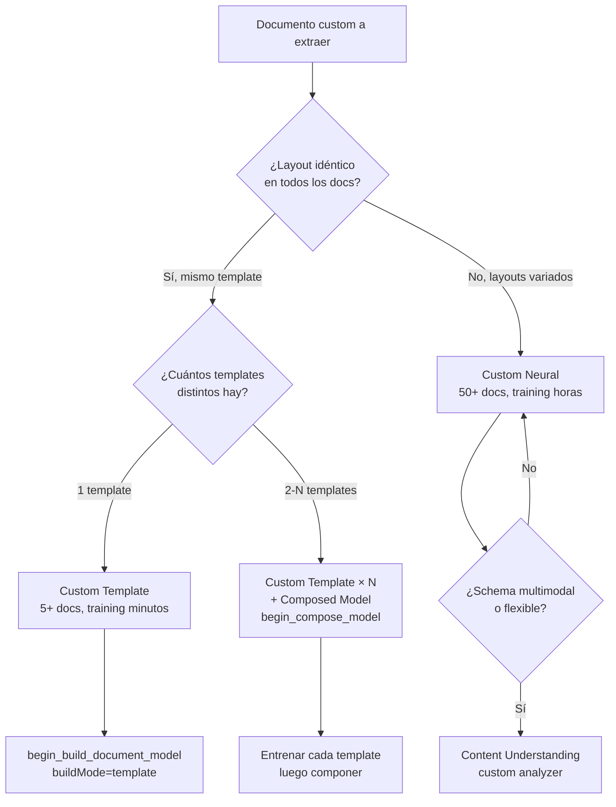
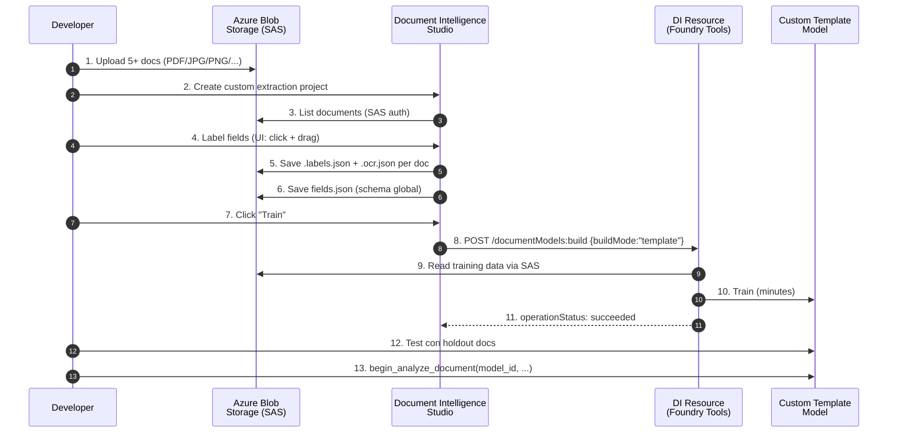
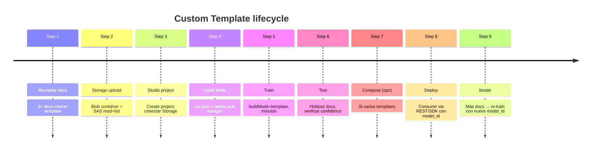

# Document Intelligence — Custom Template model (v4.0 GA `2024-11-30`)

> [!warning] AI-102 carryover
> Este tema pertenece **íntegramente al temario AI-102** ("*Implement a custom document intelligence model*" + "*Train, test, and publish a custom document intelligence model*"). En **AI-103 Microsoft recomienda Content Understanding custom analyzers** para esquemas variables y multimodal. Custom Template sigue **GA y funcional**, óptimo para **formularios MUY estandarizados** (mismo template fijo: formularios gubernamentales, facturas con plantilla única, hojas de evaluación, cuestionarios médicos). Si el examen menciona "layout fixed + ≥5 docs + training en minutos + bajo coste" → **template**. Si menciona "layouts variados + ≥50 docs + training en horas" → **neural**. Si menciona "schema flexible + multimodal" → **CU custom analyzer**.

> [!abstract] TL;DR
> Custom Template (antes "*custom form*") es un modelo custom de Document Intelligence (servicio renombrado a **"Document Intelligence — Foundry Tools"**) que extrae **key-value pairs, selection marks, signatures, tablas y regiones** de documentos con **layout fijo y repetido**. Requiere **mínimo 5 documentos** del mismo template etiquetados manualmente. Training en **pocos minutos** (vs ≤30 min de neural). Build mode: `buildMode: "template"` en REST o `DocumentBuildMode.TEMPLATE` en SDK Python (`azure-ai-documentintelligence`). Cliente: `DocumentIntelligenceAdministrationClient.begin_build_document_model(BuildDocumentModelRequest(...))`. Label tool oficial: **Document Intelligence Studio** (`formrecognizer.appliedai.azure.com/studio`). Genera `.labels.json` + `.ocr.json` + `fields.json` por documento. Límites template: **500 páginas máx / 50 MB total** training data. Cuando el layout varíe → usa **custom neural** (mismo formato de label, layout-flexible). Para combinar múltiples templates → **composed model**.

## 🎯 Relevancia en el examen

🔥🔥 Tema **estable y muy preguntado en AI-102**; residual en AI-103. Tipos de pregunta:

- **Elegir Template vs Neural** dado un escenario (número docs, layout fijo/variable, time-to-train, coste).
- **Mínimo docs training**: trampa clásica → **5 docs minimum** (no 3, no 10).
- **`buildMode` exacto**: valor literal `"template"` (lowercase string en REST) / `DocumentBuildMode.TEMPLATE` (Python).
- **Workflow correcto**: subir a Storage → label en Studio → genera `.labels.json` + `.ocr.json` → `begin_build_document_model` → poller `.result()` → test → analyze.
- **Composed model**: cuando hay 2+ templates distintos → entrenar uno por template y **componerlos** en un único endpoint con `begin_compose_model`.
- **Storage requisito**: container con **SAS URL** (read+list) — el modelo se entrena desde Blob, NO desde upload directo.
- **Studio URL legacy**: sigue siendo `formrecognizer.appliedai.azure.com/studio` (NO `documentintelligence.ai.azure.com` — no existe ese host).
- **Field types soportados**: key-value pairs, selection marks, signature, tabular (incl. cross-page tables desde v3.0+), selected regions. **NO** overlapping fields.

## 📖 Concepto en profundidad

### 1. Qué es Custom Template — naturaleza layout-bound

Modelo custom **entrenado por el usuario** que aprende a extraer fields de un **template visual específico**: misma estructura, mismos placeholders, mismas posiciones (con tolerancia a desplazamientos menores y a valores distintos por field). El modelo se basa en **layout cues** (coordenadas, proximidad a anchors textuales fijos) — por eso si el layout cambia, la accuracy se desploma.

> [!important] Definición oficial verbatim
> *"Custom template (formerly custom form) is an easy-to-train document model that accurately extracts labeled key-value pairs, selection marks, tables, regions, and signatures from documents. Template models use layout cues to extract values from documents and are suitable to extract fields from highly structured documents with defined visual templates."*

**Casos de uso ideales:**

- Formularios gubernamentales con plantilla oficial (Modelo 303 IVA, formulario 720, declaraciones aduaneras).
- Facturas de un único proveedor con plantilla fija.
- Hojas de inspección, checklists, cuestionarios médicos estandarizados.
- Formularios de aplicación con campos en posiciones fijas.

**Anti-patrones (mejor neural o CU):**

- Facturas de **múltiples proveedores** (cada uno con su layout).
- Contratos con redacción libre y estructura variable.
- Recibos en general (mejor `prebuilt-receipt` o neural).

### 2. Template vs Neural vs Composed — el árbol de decisión



### 3. Comparativa Template vs Neural (tabla quirúrgica)

| Aspecto | Custom **Template** | Custom **Neural** (custom document) |
|---|---|---|
| Layout requirement | **Fixed** (mismo template visual) | **Variable** (layout-flexible) |
| Min docs training | **5** | **5** (oficial) — pero recomendado 50+ para accuracy |
| Max pages training data | **500 pages** | **50 000 pages** |
| Max total size training data | **50 MB** | **1 GB** |
| Training time | **Pocos minutos** | **Hasta 30 minutos** |
| Coste training | Lower | Higher (más cómputo) |
| Accuracy fixed-layout | **Excellent** | Good |
| Accuracy variable layout | **Poor** | **Excellent** |
| Signature fields | ✔ | ✔ |
| Selection marks | ✔ | ✔ |
| Tables (incl. cross-page) | ✔ (v3.0+) | ✔ |
| Selected regions | ✔ | ✔ |
| Overlapping fields | ✘ Not supported | ✘ Not supported |
| Build mode | `"template"` | `"neural"` |
| Disponibilidad regional | Todas las regiones DI | **Limitada** (subset de regiones) |
| Idiomas | Más restrictivo (ver Language Support) | **Mayor cobertura** |
| Caso uso típico | Formularios gubernamentales, factura proveedor único | Facturas multi-proveedor, contratos diversos |

> [!warning] Trampa de regiones
> **Custom Neural está disponible solo en un subconjunto de regiones**. Custom Template está disponible en todas las regiones donde existe Document Intelligence. Si el examen pregunta "modelo training en region X" → confirma si neural está soportado allí.

### 4. Field types soportados

| Form fields (key-value) | Selection marks | Tabular fields (Tables) | Signature | Selected regions | Overlapping fields |
| --- | --- | --- | --- | --- | --- |
| Supported | Supported | Supported | Supported | Supported | **Not supported** |

**Detalles tabulares (v3.0+):**

- Soporte de **cross-page tables**: una tabla que se extiende por varias páginas se etiqueta como filas individuales en un mismo `table` field.
- Útiles también para "*repeating sections*" no reconocidas como tabla nativa (ej. experiencias laborales en un CV) → se modelan como `tabular field`.

### 5. Workflow completo — training pipeline



**Detalle paso a paso:**

1. **Recopilar ≥5 docs ejemplo** del mismo template (variaciones de valores OK; variaciones de layout NO).
2. **Subir a Azure Blob Storage container** (mismo container, raíz o subfolder).
3. **Generar SAS URL** del container con permisos `read + list` (mínimos: `rl`).
4. **Abrir Document Intelligence Studio** → `https://formrecognizer.appliedai.azure.com/studio`.
5. **Inicializar subscription + resource group + resource** (primera vez).
6. **Custom extraction model** tile → **Create a project** → conectar Storage.
7. **Label fields**: añadir field (➕), nombrar, seleccionar palabra(s)/región/marca en el doc. Repetir en cada doc.
8. **Studio genera automáticamente** por cada doc: `<nombre>.labels.json` (etiquetas usuario) + `<nombre>.ocr.json` (resultado OCR layout). A nivel proyecto: `fields.json` (schema global de fields).
9. **Train** → diálogo modal → `modelId` único + descripción + `buildMode` = template.
10. **Esperar a `succeeded`** (minutos).
11. **Test** desde la pestaña Models → seleccionar modelo → Test → subir doc nuevo → Analyze.
12. **Deploy / Consume** vía REST o SDK con el `modelId`.

### 6. Input requirements (training data)

| Requisito | Valor (Template) |
|---|---|
| Min docs training | **5** del mismo template |
| Max pages training data | **500** (template) / 50 000 (neural) |
| Max total size training data | **50 MB** (template) / 1 GB (neural) |
| File formats | PDF, JPEG/JPG, PNG, BMP, TIFF, HEIF (Office formats: solo Read/Layout/Classification) |
| Max file size analyze | 500 MB (S0) / 4 MB (F0) |
| Max pages per PDF/TIFF | 2 000 (S0) / 2 primeras (F0) |
| Dimensiones imagen | 50×50 px a 10 000×10 000 px |
| Min text height | 12 px en imagen 1024×768 (~8pt @ 150 DPI) |
| PDFs con password | **Deben desbloquearse antes de submit** |

> [!tip] Best practices de training data oficiales
> - Usa **PDFs basados en texto** (no escaneados) cuando sea posible.
> - Usa ejemplos con **todos los campos rellenos**.
> - Usa formularios con **valores distintos** en cada field (variedad).
> - Si las imágenes son de baja calidad → usa **10-15 imágenes**.
> - Si hay **subtle variations** (PDF digital vs scan) → incluye al menos 5 ejemplos de cada **en el mismo training set**.
> - Si hay **variaciones de layout claras** (mismo formulario, dos versiones gráficas) → entrena un modelo por variante y **compón**.

### 7. Archivos generados por Studio durante labeling

| Archivo | Ámbito | Contenido |
|---|---|---|
| `<doc>.ocr.json` | Por documento | Resultado de **Layout API** sobre el doc (palabras, líneas, tablas, bounding boxes). Generado automáticamente al añadir doc al proyecto. |
| `<doc>.labels.json` | Por documento | **Etiquetas del usuario**: qué tokens/regiones del OCR son qué field. Se va actualizando al labelar. |
| `fields.json` | Por proyecto | **Schema global**: nombres de fields, tipos (string/number/date/array/object/signature/selectionMark), required flags. |

Estos archivos viven **junto a los docs en el container Blob**. Si los borras, pierdes el labeling. Si los respaldas, puedes recrear el proyecto.

## 🏗️ Cómo se hace

### 7.1. Portal / Studio (recomendado para AI-102)

1. Abrir [Document Intelligence Studio](https://formrecognizer.appliedai.azure.com/studio).
2. Inicializar resource (si primera vez).
3. **Custom extraction model** → **Create project**.
4. Conectar Storage account + container + (opcional) folder path.
5. Etiquetar manualmente.
6. **Train** → seleccionar `buildMode = template`.
7. Esperar `succeeded`.
8. **Test** desde Models.

### 7.2. REST API (v4.0 GA)

```http
POST https://{endpoint}/documentintelligence/documentModels:build?api-version=2024-11-30
Content-Type: application/json
Ocp-Apim-Subscription-Key: {key}

{
  "modelId": "my-template-model-v1",
  "description": "Custom template model — modelo 303 IVA español",
  "buildMode": "template",
  "azureBlobSource": {
    "containerUrl": "https://mystorage.blob.core.windows.net/training-data?sv=2024-...&sp=rl&...",
    "prefix": ""
  }
}
```

Respuesta `202 Accepted` con header `Operation-Location` → polling hasta `status=succeeded`.

### 7.3. Python SDK — `azure-ai-documentintelligence`

```bash
pip install azure-ai-documentintelligence
```

#### Build (train) Custom Template Model

```python
from azure.core.credentials import AzureKeyCredential
from azure.ai.documentintelligence import DocumentIntelligenceAdministrationClient
from azure.ai.documentintelligence.models import (
    BuildDocumentModelRequest,
    DocumentBuildMode,
    AzureBlobContentSource,
)

endpoint = "https://<your-resource>.cognitiveservices.azure.com/"
key = "<your-key>"
container_sas_url = (
    "https://<storageaccount>.blob.core.windows.net/<container>"
    "?sv=2024-...&sp=rl&...&sig=..."
)

admin_client = DocumentIntelligenceAdministrationClient(
    endpoint=endpoint,
    credential=AzureKeyCredential(key),
)

build_request = BuildDocumentModelRequest(
    model_id="my-template-model-v1",
    description="Custom template — Modelo 303 IVA",
    build_mode=DocumentBuildMode.TEMPLATE,   # 'template'
    azure_blob_source=AzureBlobContentSource(
        container_url=container_sas_url,
        prefix="",   # opcional: subfolder dentro del container
    ),
)

poller = admin_client.begin_build_document_model(build_request)
model_details = poller.result()   # LROPoller → DocumentModelDetails

print(f"Model ID: {model_details.model_id}")
print(f"API version: {model_details.api_version}")
print(f"Created on: {model_details.created_date_time}")
for doc_type_name, doc_type in model_details.doc_types.items():
    print(f"DocType: {doc_type_name}")
    for field_name, field in doc_type.field_schema.items():
        print(f"  Field: {field_name} -> {field['type']}")
```

#### Test (analyze) con el modelo entrenado

```python
from azure.ai.documentintelligence import DocumentIntelligenceClient
from azure.ai.documentintelligence.models import AnalyzeDocumentRequest

client = DocumentIntelligenceClient(
    endpoint=endpoint,
    credential=AzureKeyCredential(key),
)

with open("test-doc.pdf", "rb") as f:
    poller = client.begin_analyze_document(
        model_id="my-template-model-v1",
        body=AnalyzeDocumentRequest(bytes_source=f.read()),
    )

result = poller.result()
for analyzed_doc in result.documents:
    print(f"Doc type: {analyzed_doc.doc_type}, confidence: {analyzed_doc.confidence}")
    for name, field in analyzed_doc.fields.items():
        print(f"  {name} = {field.get('content')} (conf={field.get('confidence')})")
```

#### Composed model (combinar varios templates)

```python
from azure.ai.documentintelligence.models import (
    ComposeDocumentModelRequest,
    ComponentDocumentModelDetails,
)

compose_request = ComposeDocumentModelRequest(
    model_id="composed-invoices-all-vendors",
    description="Compose: template-vendor-A + template-vendor-B",
    component_models=[
        ComponentDocumentModelDetails(model_id="template-vendor-A"),
        ComponentDocumentModelDetails(model_id="template-vendor-B"),
    ],
)
poller = admin_client.begin_compose_model(compose_request)
composed = poller.result()
```

### 7.4. Azure CLI — crear el recurso DI

```bash
# Recurso Document Intelligence (kind=FormRecognizer histórico)
az cognitiveservices account create \
  --name my-di-resource \
  --resource-group my-rg \
  --kind FormRecognizer \
  --sku S0 \
  --location westeurope \
  --yes
```

> [!warning] Kind del recurso
> A pesar del rebrand a "Document Intelligence — Foundry Tools", el **`kind` ARM sigue siendo `FormRecognizer`** por compatibilidad histórica. **NO** existe `kind=DocumentIntelligence` para el recurso standalone clásico. Para Foundry unificado se usa `kind=AIServices`.

## 📊 Tablas comparativas / cuándo usar qué

### Template vs Neural vs Composed vs Content Understanding

| Escenario | Recomendación |
|---|---|
| Formulario único, layout fijo, 5+ docs | **Custom Template** |
| Mismo "tipo" de doc, layouts variados (10+ diseños) | **Custom Neural** |
| 2-5 templates fijos a unificar en un endpoint | **Custom Template × N + Composed** |
| Schema flexible + multimodal (doc+audio+video+image) | **Content Understanding custom analyzer** |
| Documento estándar (factura, recibo, ID) | **Prebuilt** (`prebuilt-invoice`, etc.) |
| Solo OCR sin extracción de fields | **`prebuilt-layout`** o **`prebuilt-read`** |
| Clasificar antes de extraer | **Custom classifier + composed** |

### Lifecycle de un proyecto custom (mental model)



## 🪤 Trampas del examen

1. **"Mínimo 5 documentos"** → memorizar el número exacto. NO 3, NO 10. Es **5** (oficial: *"You need at least five completed forms of the same type"*).
2. **`buildMode` exacto**: REST quiere `"template"` (lowercase string). Python SDK quiere `DocumentBuildMode.TEMPLATE` (enum). **NO** existe `"custom-template"`, `"CustomTemplate"` ni `"form"`.
3. **Studio URL legacy**: el host correcto es `formrecognizer.appliedai.azure.com/studio`. La URL `documentintelligence.ai.azure.com` **NO EXISTE** (es típica trampa de pregunta).
4. **Layout fijo vs variable**: si el enunciado dice "*invoices from many different vendors*" → **NEURAL**, no template. Si dice "*same form template completed by users*" → **TEMPLATE**.
5. **Training time**: template = **pocos minutos**; neural = **hasta 30 min**. Si la pregunta valora "fastest training" sobre formularios estandarizados → template.
6. **Storage requirement**: training data **debe estar en Azure Blob Storage** con **SAS URL** (permisos `read + list`). NO se sube directamente al servicio.
7. **Archivos generados**: `.labels.json` (user labels) y `.ocr.json` (Layout OCR result) — **uno por documento**. `fields.json` es **uno por proyecto** (schema global). Si la pregunta los lista, identifícalos.
8. **Composed model para múltiples templates**: pregunta clásica → "*I have 3 different invoice layouts from 3 vendors. How do I serve them from a single endpoint?*" → entrenar 3 templates y **`begin_compose_model`**.
9. **Overlapping fields NO soportados** — ni en template ni en neural. Si el enunciado describe campos solapados, ninguno de los dos sirve directamente.
10. **Max pages training = 500 (template)** vs 50 000 (neural). Si el ejercicio menciona 10 000+ pages de training → debe ser **neural**.
11. **Regional availability**: neural tiene **regiones limitadas**; template está en todas. Si el examen indica una región exótica → preferir template.
12. **Cost training**: template **cheaper** (menos cómputo, menos tiempo). Si el escenario optimiza coste → template.
13. **`AzureBlobContentSource` parámetro**: en Python se llama `container_url` (no `containerUrl`, no `url`). En REST JSON sí es `containerUrl`.
14. **`DocumentIntelligenceAdministrationClient` vs `DocumentIntelligenceClient`**: **Administration** para **build/list/delete/compose modelos**. **Client** para **analyze documents**. Confundirlos es trampa.
15. **AI-103 prefiere CU custom analyzer** para variable schema + multimodal — pero **template sigue siendo la opción correcta cuando layout es realmente fijo**, no descartar por reflejo.

## 🧠 Mnemotecnia

> **TEMPLATE = "TEMPlado y PLAno" (TEMPlate = TEMPlado = sin variaciones; PLAno = layout PLAno fijo)**.
>
> **Regla del 5 / 50 / 500 / 50K**:
> - **5** docs mínimo template (y neural).
> - **50 MB** total training data template.
> - **500 pages** máx training template.
> - **50 000 pages** máx training neural.
>
> **Build modes (memorizar literal)**: `"template"` · `"neural"` · `"generative"`.
>
> **Studio host = "formrecognizer.appliedai"** — recuerda el nombre legacy "Form Recognizer" pegado al host. Si te ofrecen `documentintelligence.ai.azure.com` → **trampa, no existe**.
>
> **Three clients, three jobs**:
> - `DocumentIntelligenceClient` → **analyze**.
> - `DocumentIntelligenceAdministrationClient` → **build/manage models & classifiers**.
> - (Implícito) Studio UI → **label**.
>
> **Decision tree de un examinado eficiente**:
> "¿Layout fijo?" → Sí: Template. No: "¿Necesito CU multimodal?" → No: Neural. Sí: CU.

## 🔗 Conceptos relacionados

- [[extract-document-intelligence-prebuilt]] — schema fijo de Microsoft, cero training.
- [[extract-document-intelligence-custom-neural]] — layout-flexible, training horas, 50 docs+ recomendado.
- [[extract-document-intelligence-classifiers]] — clasificación previa para enrutar a sub-modelos.
- [[extract-document-intelligence-composed]] — combinar varios templates en endpoint único.
- [[extract-content-understanding-overview]] — el sucesor recomendado AI-103 para schemas variables y multimodal.
- [[extract-content-understanding-analyzers]] — custom analyzers CU como alternativa moderna.
- [[extract-ocr-layout-fields-multimodal]] — Layout API base (genera `.ocr.json` durante labeling).
- [[plan-storage-blob-for-ai]] — requisitos SAS URL del container training.

## ❓ Autotest

**1.** Tienes 8 documentos PDF, todos copias completadas del **mismo formulario gubernamental** (Modelo 303 IVA), con los mismos campos en las mismas posiciones. Necesitas un modelo que extraiga `nombre`, `nif`, `total_iva`, `casilla_46`. ¿Qué eliges?

- a) `prebuilt-tax.us.w2`
- b) Custom Neural (50+ docs)
- c) Custom Template
- d) Content Understanding multimodal analyzer

<details><summary>Respuesta</summary>

**c) Custom Template.** Layout fijo + 8 docs (>5 min) + campos en posiciones fijas → caso de uso canónico template. (a) es US W-2, irrelevante para 303 ES. (b) overkill, requiere ~50 docs y horas. (d) CU es válido pero overkill para layout fijo simple; template entrena en minutos.
</details>

**2.** Estás llamando a la REST API v4.0 para crear un custom template model. ¿Cuál es el valor correcto de `buildMode` en el body JSON?

- a) `"customTemplate"`
- b) `"template"`
- c) `"Template"`
- d) `"form"`

<details><summary>Respuesta</summary>

**b) `"template"`** (lowercase). Verbatim docs: *"set the `buildMode` to `template`"*. En Python SDK el equivalente es el enum `DocumentBuildMode.TEMPLATE` (que serializa a `"template"`).
</details>

**3.** ¿Cuál es la URL correcta del Document Intelligence Studio para labelar tu dataset de training?

- a) `https://documentintelligence.ai.azure.com/studio`
- b) `https://ai.azure.com/document-intelligence`
- c) `https://formrecognizer.appliedai.azure.com/studio`
- d) `https://portal.azure.com/document-intelligence-studio`

<details><summary>Respuesta</summary>

**c) `https://formrecognizer.appliedai.azure.com/studio`.** A pesar del rebrand a "Document Intelligence — Foundry Tools", el host del Studio sigue siendo el legacy `formrecognizer.appliedai.azure.com`. La opción (a) suena plausible pero **no existe**: es trampa típica.
</details>

**4.** Tu cliente tiene **3 layouts distintos** de facturas (3 proveedores diferentes con plantillas fijas pero distintas entre sí) y necesita un **único endpoint** para extracción. ¿Cuál es la estrategia óptima en Document Intelligence?

- a) Entrenar un único custom neural con los 3 layouts mezclados (≥50 docs cada uno).
- b) Entrenar 3 custom template (uno por layout, ≥5 docs cada uno) y luego `begin_compose_model` para unificar.
- c) Usar `prebuilt-invoice` para los 3.
- d) Crear 3 endpoints separados y enrutar manualmente.

<details><summary>Respuesta</summary>

**b) 3 custom templates + composed model.** Cada layout fijo → un template (training en minutos, 5+ docs c/u). Luego `DocumentIntelligenceAdministrationClient.begin_compose_model(...)` combina los 3 en un único `modelId` consumible. (a) sería válido si los layouts fueran muy variados (custom neural absorbería la diversidad) pero requiere mucho más training data y tiempo. (c) `prebuilt-invoice` puede funcionar si los layouts son estándar de invoice global, pero no extrae fields custom específicos del cliente. (d) viola el requisito "endpoint único".
</details>

**5.** ¿Qué clase del SDK Python `azure-ai-documentintelligence` usarías para **entrenar** un custom template model?

- a) `DocumentIntelligenceClient.begin_train_model(...)`
- b) `FormRecognizerClient.begin_training(...)`
- c) `DocumentIntelligenceAdministrationClient.begin_build_document_model(...)`
- d) `DocumentModelAdministrationClient.begin_build_model(...)`

<details><summary>Respuesta</summary>

**c) `DocumentIntelligenceAdministrationClient.begin_build_document_model(...)`.** Toma un `BuildDocumentModelRequest` con `model_id`, `build_mode=DocumentBuildMode.TEMPLATE` y `azure_blob_source=AzureBlobContentSource(container_url=...)`. Devuelve `LROPoller[DocumentModelDetails]`. (a) `DocumentIntelligenceClient` es para **analyze**, no para build. (b) `FormRecognizerClient` es la clase **legacy** del paquete deprecado `azure-ai-formrecognizer`. (d) `DocumentModelAdministrationClient.begin_build_model` era el nombre legacy en `azure-ai-formrecognizer` v3.x, no en el SDK actual `azure-ai-documentintelligence`.
</details>

## ✅ Control de calidad (auto-rúbrica)

| Dimensión | Nota | Evidencia |
|---|---|---|
| Completitud | **9.5** | Cubre los 2 sub-puntos AI-102 ("implement" + "train/test/publish"), template vs neural vs composed vs CU, workflow Studio + REST + Python, límites cuantitativos verificados, deprecations, regional caveats, training data tips. Mnemotecnia 5/50/500/50K. |
| Exactitud técnica | **9.5** | Verificado contra Microsoft Learn (`/document-intelligence/train/custom-template` v4.0, `how-to/build-a-custom-model`, Python SDK reference `DocumentIntelligenceAdministrationClient`). Studio URL, `buildMode` literal, API version `2024-11-30`, kind ARM `FormRecognizer`, límites 500 pages / 50 MB confirmados. Clases SDK exactas. |
| Alineación al examen | **9.5** | 15 trampas reales, 5 preguntas estilo examen (escenario-driven), foco en distinciones template/neural/composed/CU que Microsoft examina activamente, datos numéricos memorizables, marca AI-102 carryover en frontmatter + callout. |
| Claridad pedagógica | **9.5** | 3 mermaid (flowchart, sequence, timeline), 6 tablas comparativas, mnemotecnia "TEMPlado y PLAno" + regla 5/50/500/50K, callouts !warning/!important/!tip, ejemplos de código completos auth→build→analyze→compose, decision tree explícito. |

*Verificado a fecha 2026-05-23 contra Microsoft Learn (`ms.date: 2025-11-18` en ambas fuentes principales; Python SDK reference `updated_at: 2025-04-04`). Servicio rebranded a "Document Intelligence — Foundry Tools" pero APIs/SDK retain legacy naming para compatibilidad.*
