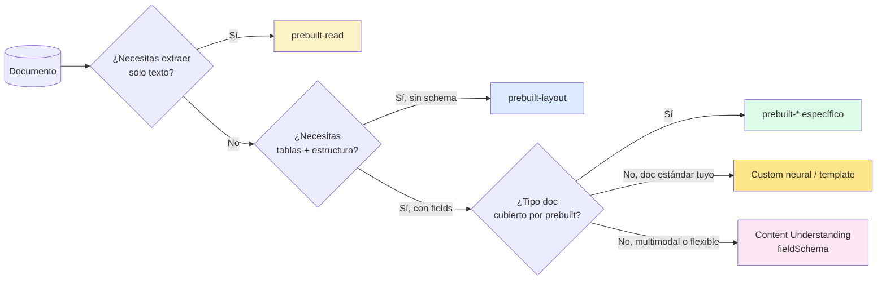
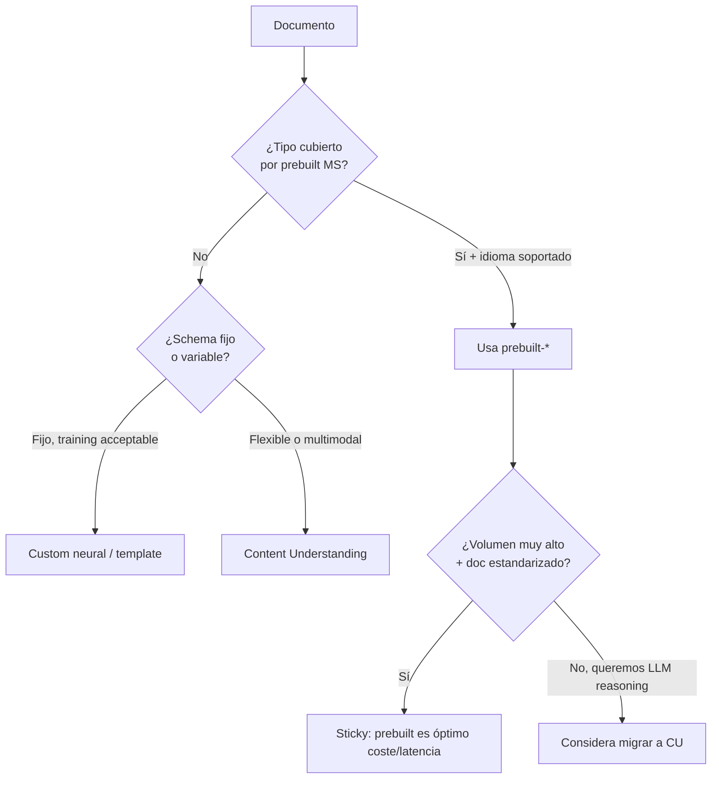

# Document Intelligence — Prebuilt models (v4.0 GA `2024-11-30`)

> [!warning] AI-102 carryover
> Este tema pertenece **principalmente al temario AI-102** ("Use prebuilt models to extract data from documents") y conserva relevancia residual en AI-103 como **punto de comparación** con Azure **Content Understanding**. En AI-103 Microsoft recomienda CU para escenarios *multimodal + schema-flexible*, pero **DI prebuilt sigue siendo GA y la opción canónica para documentos estandarizados de alto volumen** (facturas, recibos, IDs, formularios fiscales/mortgage US).

> [!abstract] TL;DR
> Document Intelligence (antes Form Recognizer) ofrece **modelos pre-entrenados por Microsoft** que extraen datos de tipos de documento comunes **sin training** y con **schema fijo no editable**. v4.0 GA (`2024-11-30`) cubre `prebuilt-read`, `prebuilt-layout`, `prebuilt-invoice` (27 idiomas), `prebuilt-receipt`, `prebuilt-idDocument` (worldwide tras v4.0), `prebuilt-contract`, `prebuilt-healthInsuranceCard.us`, familia `prebuilt-tax.us.*` (W-2, W-4, 1040, 1095, 1098, 1099), familia `prebuilt-mortgage.us.*` (1003, 1004, 1005, 1008, closingDisclosure), `prebuilt-marriageCertificate.us`, `prebuilt-creditCard`, `prebuilt-check.us`, `prebuilt-bankStatement`, `prebuilt-payStub.us`. ⚠️ **`prebuilt-businessCard` está deprecated en v4.0**; **`prebuilt-document` ya no se soporta** — sus capacidades viven ahora en `prebuilt-layout`. SDK Python: `azure-ai-documentintelligence` → `DocumentIntelligenceClient.begin_analyze_document(model_id, AnalyzeDocumentRequest(url_source=...))`. Límites: PDF/TIFF **2000 páginas, 500 MB (S0)** / **4 MB y solo 2 primeras páginas (F0)**.

## 🎯 Relevancia en el examen

🔥🔥 Tema **estable y aún preguntado** (AI-102 carryover). Tipos de pregunta:

- **Elegir el `modelId` correcto** dado un escenario (recibo de hotel → `prebuilt-receipt`; W-2 estadounidense → `prebuilt-tax.us.w2`; pasaporte mexicano → `prebuilt-idDocument` (v4.0 worldwide)).
- **Diferenciar prebuilt vs custom vs Content Understanding**: schema fijo vs entrenable vs schema-flexible multimodal.
- **Trampas de nomenclatura post-rebrand**: la clase ya **NO es** `FormRecognizerClient` — es `DocumentIntelligenceClient` (paquete `azure-ai-documentintelligence`).
- **API version**: `2024-11-30` GA — NO `2023-07-31` (era v3.1) ni `2022-08-31` (era v3.0).
- **Async pattern**: `begin_analyze_document` devuelve un **poller (LRO)** — siempre `.result()` para obtener el `AnalyzeResult`.
- **Modelos US-only**: tax + mortgage + check + payStub + healthInsuranceCard + marriageCertificate son **US-centric** (sufijo `.us` o por contexto). Para España/EU usa **custom neural** o **Content Understanding** con `fieldSchema`.
- **Deprecations clave**: `prebuilt-businessCard` (deprecated v4.0) y `prebuilt-document` general (sustituido por layout).

## 📖 Concepto en profundidad

### 1. Qué es un prebuilt model

Modelo de Document Intelligence **pre-entrenado por Microsoft** sobre miles de variaciones de un tipo documental común (factura, recibo, DNI, W-2…). Características invariantes:

| Propiedad | Valor |
|---|---|
| Training requerido | **0** (use out-of-the-box) |
| Schema | **Fijo y no editable** (definido por Microsoft) |
| Latencia | Asíncrono (Long-Running Operation con polling) |
| Output | JSON con `fields{}`, `confidence` por field, `content` OCR, `pages[]`, `tables[]` |
| Grounding | `boundingRegions` + `spans` por field |
| Coste | Per page (Free F0: 500 págs/mes; S0 pay-per-page) |
| API version GA | `2024-11-30` (v4.0) |

> [!important] Diferencia conceptual prebuilt vs custom vs CU
> - **Prebuilt** → schema fijado por Microsoft. Cero training. Inmediato.
> - **Custom neural / template** → tú defines schema y labelas docs. Training necesario.
> - **Content Understanding** → schema flexible vía `fieldSchema`, multimodal (doc + audio + video + image), LLM-backed, sin training pero con prompt engineering.

### 2. Catálogo completo v4.0 GA (verificado `model-overview` 2026-01-23)

```mermaid
flowchart TD
  ROOT[Document Intelligence v4.0<br/>2024-11-30 GA] --> ANALYSIS[Document analysis models]
  ROOT --> PREBUILT[Prebuilt domain models]
  ROOT --> CUSTOM[Custom models]

  ANALYSIS --> R[prebuilt-read<br/>OCR puro]
  ANALYSIS --> L[prebuilt-layout<br/>estructura + tables + selection marks<br/>+ subsume prebuilt-document]

  PREBUILT --> BUS[Business]
  PREBUILT --> ID[Identity]
  PREBUILT --> TAX[US Tax]
  PREBUILT --> MORT[US Mortgage]
  PREBUILT --> FIN[US Financial]
  PREBUILT --> MISC[Misc]

  BUS --> INV[prebuilt-invoice<br/>27 langs]
  BUS --> REC[prebuilt-receipt]
  BUS --> CON[prebuilt-contract]
  BUS --> BC[prebuilt-businessCard<br/>DEPRECATED v4.0]

  ID --> IDD[prebuilt-idDocument<br/>worldwide v4.0]
  ID --> HIC[prebuilt-healthInsuranceCard.us]
  ID --> MC[prebuilt-marriageCertificate.us]

  TAX --> W2[prebuilt-tax.us.w2]
  TAX --> W4[prebuilt-tax.us.w4]
  TAX --> T1040[prebuilt-tax.us.1040 + variants]
  TAX --> T1095[prebuilt-tax.us.1095A/C]
  TAX --> T1098[prebuilt-tax.us.1098/1098E/1098T]
  TAX --> T1099[prebuilt-tax.us.1099 + 1099SSA]
  TAX --> UNI[prebuilt-tax.us<br/>unified]

  MORT --> M1003[prebuilt-mortgage.us.1003 URLA]
  MORT --> M1004[prebuilt-mortgage.us.1004 URAR]
  MORT --> M1005[prebuilt-mortgage.us.1005]
  MORT --> M1008[prebuilt-mortgage.us.1008]
  MORT --> MCD[prebuilt-mortgage.us.closingDisclosure]

  FIN --> CHK[prebuilt-check.us]
  FIN --> BS[prebuilt-bankStatement]
  FIN --> PS[prebuilt-payStub.us]
  FIN --> CC[prebuilt-creditCard]

  CUSTOM --> CT[Custom template]
  CUSTOM --> CN[Custom neural]
  CUSTOM --> CCL[Custom classifier]
  CUSTOM --> COMP[Custom composed]
```



### 3. Tabla maestra de modelos — features extraídos

> Verbatim de `model-overview` (✓ enabled · O optional add-on · vacío no soportado).

| Model ID | Content | QueryFields | Tables | KV pairs | Selection marks | Paragraph roles | Doc analysis |
|---|---|---|---|---|---|---|---|
| `prebuilt-read` | ✓ |  |  |  |  |  |  |
| `prebuilt-layout` | ✓ | ✓ | ✓ | O | ✓ | ✓ |  |
| `prebuilt-invoice` | ✓ | ✓ | ✓ | O | ✓ |  | ✓ |
| `prebuilt-receipt` | ✓ | ✓ |  |  |  |  | ✓ |
| `prebuilt-contract` | ✓ | ✓ |  |  | ✓ | ✓ | ✓ |
| `prebuilt-idDocument` | ✓ | ✓ |  |  |  |  | ✓ |
| `prebuilt-healthInsuranceCard.us` | ✓ | ✓ |  |  |  |  | ✓ |
| `prebuilt-marriageCertificate.us` | ✓ | ✓ |  |  | ✓ |  | ✓ |
| `prebuilt-creditCard` | ✓ | ✓ |  |  |  |  | ✓ |
| `prebuilt-check.us` | ✓ | ✓ |  |  |  |  | ✓ |
| `prebuilt-payStub.us` | ✓ | ✓ |  |  |  |  | ✓ |
| `prebuilt-bankStatement` | ✓ | ✓ |  |  |  |  | ✓ |
| `prebuilt-mortgage.us.*` | ✓ | ✓ |  |  | ✓ |  | ✓ |
| `prebuilt-tax.us.*` | ✓ | ✓ |  |  | ✓ (la mayoría) |  | ✓ |

> [!warning] Query Fields no aplica en US tax models
> El add-on `queryFields` está disponible para todos los prebuilt **excepto los US tax models** (verbatim docs `model-overview`).

### 4. Document analysis vs Prebuilt vs Custom — la jerarquía



### 5. Modelos clave — schemas verificados

#### `prebuilt-invoice` — 27 idiomas

Documentos soportados: **invoices, utility bills, sales orders, purchase orders**. Fields (verbatim invoice schema):

| Field | Tipo | Notas |
|---|---|---|
| `VendorName`, `VendorAddress`, `VendorAddressRecipient`, `VendorTaxId` | string | Emisor |
| `CustomerName`, `CustomerAddress`, `CustomerId`, `CustomerTaxId` | string | Receptor |
| `InvoiceId`, `InvoiceDate`, `DueDate`, `PurchaseOrder` | string/date | Identificadores |
| `SubTotal`, `TotalTax`, `InvoiceTotal`, `AmountDue`, `PreviousUnpaidBalance` | currency | Totales |
| `BillingAddress`, `ShippingAddress` | string | Direcciones |
| `RemittanceAddress`, `ServiceAddress` | string |  |
| `ServiceStartDate`, `ServiceEndDate` | date |  |
| `Items[]` | array | Cada item: `Amount`, `Description`, `Quantity`, `UnitPrice`, `ProductCode`, `Unit`, `Date`, `Tax`, `TaxRate` |

#### `prebuilt-receipt` — incluye hotel receipts v4.0

Fields nuevos en v4.0: `ReceiptType`, `TaxDetails.NetAmount`, `TaxDetails.Description`, `TaxDetails.Rate`, `CountryRegion`, VAT table extraction para hotel receipts.

| Field | Tipo |
|---|---|
| `MerchantName`, `MerchantPhoneNumber`, `MerchantAddress` | string |
| `TransactionDate`, `TransactionTime` | date/time |
| `Total`, `Subtotal`, `TotalTax`, `Tip` | currency |
| `Items[]` (con `Description` ⚠️ antes `Name`, `Quantity`, `Price`, `TotalPrice`) | array |
| `CountryRegion`, `ReceiptType`, `TaxDetails[]` (v4.0) | enum / string / array |

> [!warning] Renombre histórico
> En v2.1 el campo se llamaba `Tax` y `Name`; desde 2022-06-30 son `TotalTax` y `Description`. **Pregunta-trampa típica**.

#### `prebuilt-idDocument` — worldwide en v4.0 (clave del cambio AI-103)

| Región | Document types soportados |
|---|---|
| **Worldwide** | Passport Book, Passport Card |
| **United States** | Driver License, Identification Card, Residency Permit (Green card), Social Security Card, Military ID |
| **India** | Driver License, PAN Card, Aadhaar Card |
| **Australia** | Driver License, Photo Card, Key-pass ID |
| **Other** | Driver License, Identification Card, Residency Permit |

Fields v4.0: `FirstName`, `LastName`, `DocumentNumber`, `DateOfBirth`, `DateOfExpiration`, `Sex`, `Address`, `Region`, `Country`, `Nationality`, `DateOfIssue`, `PlaceOfIssue`, `MachineReadableZone` (passports), `DocumentType`.

> [!important] DI vs Face / Verified-ID
> Document Intelligence `prebuilt-idDocument` **extrae datos del documento**; **no** verifica autenticidad ni hace face-match. Para verificación de identidad real usa **Microsoft Entra Verified ID** (decentralized) o pipeline con **Azure AI Vision Face** liveness.

#### `prebuilt-layout` — sustituye `prebuilt-document`

> [!warning] `prebuilt-document` deprecated
> Verbatim docs: *"All the capabilities for the general document model are available in the layout model. The general model is no longer supported."* → migra a `prebuilt-layout` con add-on `keyValuePairs` y/o `queryFields`.

Extrae: `pages[]`, `paragraphs[]` (con `role` = `title`, `sectionHeading`, `pageHeader`, `pageFooter`, `footnote`, `pageNumber`), `tables[]` (con cells, rowSpan, columnSpan, kind), `selectionMarks[]` (✓ checkboxes), `figures[]`, `sections[]`, `styles[]` (handwritten detection), `keyValuePairs[]` (add-on), `formulas[]` (add-on), `barcodes[]` (free), `languages[]` (free).

#### Familia `prebuilt-tax.us.*` y `prebuilt-mortgage.us.*` — US-only English

Estos modelos están entrenados **solo para formularios fiscales y mortgage de US** (lengua inglesa). Para España/EU **no existe equivalente prebuilt** — usa custom neural o Content Understanding.

| Tax model | Cubre |
|---|---|
| `prebuilt-tax.us` | Unified (clasifica + extrae) |
| `prebuilt-tax.us.w2` | W-2 (compensation) |
| `prebuilt-tax.us.w4` | W-4 |
| `prebuilt-tax.us.1040` (+ variants) | Personal income tax |
| `prebuilt-tax.us.1095` (A/C) | Health insurance |
| `prebuilt-tax.us.1098` (+ 1098E, 1098T) | Mortgage interest / student loan / tuition |
| `prebuilt-tax.us.1099` (+ 1099SSA) | Income from non-employer sources (DIV, INT, MISC, NEC, etc.) |

| Mortgage model | Cubre |
|---|---|
| `prebuilt-mortgage.us.1003` | URLA — Uniform Residential Loan Application |
| `prebuilt-mortgage.us.1004` | URAR — Uniform Residential Appraisal Report |
| `prebuilt-mortgage.us.1005` | Verification of Employment |
| `prebuilt-mortgage.us.1008` | Summary document |
| `prebuilt-mortgage.us.closingDisclosure` | Closing Disclosure |

### 6. Add-on capabilities (v4.0)

| Add-on | Tipo | Disponible v4.0 GA |
|---|---|---|
| `ocrHighResolution` | Premium | ✓ |
| `formulas` | Premium | ✓ |
| `styleFont` | Premium | ✓ |
| `barcodes` | Free | ✓ |
| `languages` | Free | ✓ |
| `keyValuePairs` | Free | ✓ (solo v4.0) |
| `queryFields` | Premium\* | ✓ (no US tax) |
| `searchablePDF` | Premium\* | ✓ (solo `prebuilt-read`) |

\* Premium = facturado aparte del análisis base.

### 7. Confidence scores

- **Per field**: float `[0, 1]`. Microsoft recomienda umbral típico `≥ 0.7` para automatización; valores menores → **human-in-the-loop review**.
- **Per word** (en `pages[].words[].confidence`).
- **Per cell / table cell**.
- **No hay** "confidence per document" agregado; calcúlalo tú como weighted average si lo necesitas.

### 8. Límites operacionales (input requirements verbatim)

| Límite | Valor |
|---|---|
| Tamaño archivo (S0) | **500 MB** |
| Tamaño archivo (F0) | **4 MB** |
| Páginas PDF / TIFF | **2000** (F0: solo **2 primeras**) |
| Dimensiones imagen | 50×50 px → 10 000×10 000 px |
| Altura mínima texto | 12 px @ 1024×768 (≈ 8 pt @ 150 dpi) |
| Office (DOCX/XLSX/PPTX/HTML) | máx. 8 000 000 caracteres |
| PDFs password-locked | NO soportados (quitar lock antes) |

> [!warning] Trampa pregunta-examen
> El brief original decía **"500 MB PDF, 10 MB image"** — ✅ corregido: la cifra correcta es **500 MB para S0 y 4 MB para F0**, sin distinción PDF vs image (la distinción de tamaño que sí existe es entre **tiers**, no entre formatos). La distinción de páginas sí es por formato: PDF/TIFF hasta 2000, imagen siempre 1.

## 🏗️ Cómo se hace (Python SDK + REST + CLI)

### Instalación

```bash
pip install azure-ai-documentintelligence azure-identity
```

> [!warning] NO confundir paquetes
> - ✅ **`azure-ai-documentintelligence`** → SDK actual (v4.0 GA). Clase `DocumentIntelligenceClient`.
> - ❌ `azure-ai-formrecognizer` → SDK **legacy** (v3.1 y previos). Clase `DocumentAnalysisClient`/`FormRecognizerClient`. **Deprecated**, no preguntará AI-103.

### Patrón canónico — `prebuilt-invoice` desde URL

```python
from azure.ai.documentintelligence import DocumentIntelligenceClient
from azure.ai.documentintelligence.models import AnalyzeDocumentRequest
from azure.identity import DefaultAzureCredential

# 1. Cliente — autenticación recomendada Entra ID (DefaultAzureCredential)
client = DocumentIntelligenceClient(
    endpoint="https://my-di.cognitiveservices.azure.com/",
    credential=DefaultAzureCredential()
)

# 2. Lanzar Long-Running Operation
poller = client.begin_analyze_document(
    model_id="prebuilt-invoice",
    body=AnalyzeDocumentRequest(url_source="https://example.com/invoice.pdf"),
)

# 3. Esperar resultado (bloquea hasta completar)
result = poller.result()  # tipo: AnalyzeResult

# 4. Iterar documentos detectados (normalmente 1 por archivo)
for idx, doc in enumerate(result.documents or []):
    print(f"--- Document #{idx} (doc_type={doc.doc_type}, confidence={doc.confidence}) ---")
    fields = doc.fields or {}

    vendor = fields.get("VendorName")
    if vendor:
        print(f"Vendor: {vendor.value_string} (conf={vendor.confidence})")

    total = fields.get("InvoiceTotal")
    if total:
        # currency type → .value_currency.amount + .value_currency.currency_symbol
        print(f"Total: {total.value_currency.amount} {total.value_currency.currency_code}")

    items = fields.get("Items")
    if items and items.value_array:
        for item in items.value_array:
            obj = item.value_object or {}
            desc = obj.get("Description")
            amount = obj.get("Amount")
            print(f"  - {desc.value_string if desc else '?'}: "
                  f"{amount.value_currency.amount if amount else '?'}")

# 5. Output OCR + estructura adicional
print("Full content (OCR):", result.content[:200], "...")
for page in result.pages:
    print(f"Page {page.page_number}: {len(page.words)} words, {len(page.lines)} lines")
for table in result.tables or []:
    print(f"Table: {table.row_count} x {table.column_count}")
```

### Patrón con bytes / stream local

```python
with open("invoice.pdf", "rb") as f:
    poller = client.begin_analyze_document(
        model_id="prebuilt-invoice",
        body=f,
        content_type="application/octet-stream",
    )
    result = poller.result()
```

### Provisión del recurso (Azure CLI)

```bash
# Recurso Document Intelligence — kind="FormRecognizer" (nombre legacy ARM)
az cognitiveservices account create \
  --name my-di \
  --kind FormRecognizer \
  --sku S0 \
  --resource-group rg-doc-intel \
  --location eastus \
  --custom-domain my-di
```

> [!warning] El `--kind` sigue siendo `FormRecognizer` en ARM
> Aunque el servicio se rebrandó a *Document Intelligence* (y en Foundry Tools aparece como tal), el **provider ARM** sigue exponiendo `kind=FormRecognizer` para retro-compatibilidad. Trampa típica de examen sobre Bicep/ARM. Alternativa actual: usar un **Foundry resource** unificado (`kind=AIServices`) que también expone Document Intelligence.

### REST API directa (`2024-11-30`)

```http
POST https://my-di.cognitiveservices.azure.com/documentintelligence/documentModels/prebuilt-invoice:analyze?api-version=2024-11-30
Content-Type: application/json
Ocp-Apim-Subscription-Key: <key>

{ "urlSource": "https://example.com/invoice.pdf" }
```

Response `202 Accepted` con header `Operation-Location: https://.../analyzeResults/{resultId}?api-version=2024-11-30`. Polling:

```http
GET https://my-di.cognitiveservices.azure.com/documentintelligence/documentModels/prebuilt-invoice/analyzeResults/{resultId}?api-version=2024-11-30
```

Status `succeeded` → JSON con `analyzeResult.{documents,pages,tables,paragraphs,styles,content}`.

### Bicep — recurso DI con managed identity

```bicep
resource di 'Microsoft.CognitiveServices/accounts@2023-05-01' = {
  name: 'my-di'
  location: 'eastus'
  kind: 'FormRecognizer'         // ⚠️ NO 'DocumentIntelligence'
  sku: {
    name: 'S0'                    // F0 = free tier (limitado)
  }
  identity: {
    type: 'SystemAssigned'
  }
  properties: {
    customSubDomainName: 'my-di'
    publicNetworkAccess: 'Enabled'
  }
}
```

## 📊 Cuándo prebuilt vs Custom vs Content Understanding

| Escenario | Recomendado | Por qué |
|---|---|---|
| Factura estandarizada (proveedor cambia) | `prebuilt-invoice` | Out-of-the-box, 27 idiomas |
| Factura con campos propietarios | **Custom neural** o **CU** | Schema editable |
| Recibo (impreso o manuscrito) | `prebuilt-receipt` | Incluye hotel v4.0 |
| Pasaporte / DNI | `prebuilt-idDocument` | Worldwide desde v4.0 |
| Solo texto plano (PDF buscable) | `prebuilt-read` | Más barato + `searchablePDF` |
| Estructura: tablas + secciones + reading order | `prebuilt-layout` | Sustituye `prebuilt-document` |
| Formulario corporativo único | Custom template (estructurado) o neural | Template requiere mismo layout; neural acepta variaciones |
| Múltiples tipos doc clasificar antes | Custom classifier → composed | Routing |
| Multimodal (doc + audio call + imagen) | **Content Understanding** | Único analyzer multimodal |
| Schema flexible sin training | **Content Understanding** | LLM-backed con `fieldSchema` |
| Doc fiscal/mortgage US estándar | `prebuilt-tax.us.*` / `prebuilt-mortgage.us.*` | US-only |
| Doc fiscal/mortgage España/EU | **Custom neural** o **CU** | No hay prebuilt EU |

### Árbol de decisión rápido



## 🪤 Trampas del examen

1. **Schema FIJO en prebuilt** — *no se puede añadir campos*. Si el examen describe "necesitas extraer X campo no estándar de invoice" → **custom** o **CU**, NO prebuilt-invoice + extensión.
2. **`prebuilt-document` ya no existe en v4.0 GA**. Capacidades movidas a `prebuilt-layout`. Si una pregunta menciona `prebuilt-document` está testeando si conoces la deprecation. Respuesta correcta: layout.
3. **`prebuilt-businessCard` está deprecated en v4.0**. Sigue funcionando en v3.1 pero no es la respuesta correcta para v4.0 GA. Para business cards en v4.0 → custom neural o CU.
4. **Tax + mortgage + check + payStub + healthInsuranceCard + marriageCertificate son US-only**. Para España no hay equivalente prebuilt — la respuesta correcta es **Custom neural** o **Content Understanding con fieldSchema**.
5. **`prebuilt-idDocument` es worldwide DESDE v4.0** (cambio importante). En v3.x era US + international passport bio page. Trampa: si dice "v3.1 documento de India" → respuesta = passport sí, driver license no; pero en v4.0 sí cubre India driver license + PAN + Aadhaar.
6. **SDK class correcta**: `DocumentIntelligenceClient` del paquete `azure-ai-documentintelligence`. `FormRecognizerClient` y `DocumentAnalysisClient` son **legacy** (paquete `azure-ai-formrecognizer`). Si la pregunta muestra `from azure.ai.formrecognizer import ...` → respuesta marcando que está usando SDK obsoleto.
7. **API version `2024-11-30`** es la v4.0 GA. `2023-07-31` es v3.1, `2022-08-31` es v3.0. NO escribir "2024-07-31" u otras combinaciones inventadas.
8. **Operación es asíncrona (LRO)**: `begin_analyze_document` devuelve un **poller**. NO existe `analyze_document` síncrono. Hay que llamar `.result()` o `.wait()`.
9. **`Tax`→`TotalTax` y `Name`→`Description`** en receipts desde 2022-06-30. Código antiguo que use `fields["Tax"]` o `items.value["Name"]` falla.
10. **ARM `kind=FormRecognizer`** (no `DocumentIntelligence`) — retro-compatibilidad. Trampa típica en preguntas Bicep / Terraform / `az cognitiveservices account create`.
11. **`queryFields` NO disponible para US tax models** — si la pregunta combina W-2 + queryFields → respuesta = no soportado.
12. **F0 (free) procesa solo las 2 primeras páginas** de PDF/TIFF (no las 2000) y máx **4 MB**. Trampa en preguntas de coste/PoC.
13. **PDFs password-locked → fallan**. Si el escenario menciona docs protegidos, hay que quitar password antes.
14. **`searchablePDF` solo en `prebuilt-read`** (no en layout ni en prebuilt-invoice). Pregunta-trampa: "quiero PDF buscable a partir de imágenes escaneadas" → `prebuilt-read` con `output=pdf`.
15. **`prebuilt-mortgage.us.marriageCertificate` NO existe**. El modelo correcto es `prebuilt-marriageCertificate.us` (separado de la familia mortgage).
16. **F0 free tier**: 500 páginas/mes. Si la pregunta dice "uso ocasional 200 docs/mes 1 página cada uno" → F0 cubre; si dice "10 000 docs/mes" → S0 obligatorio.

## 🧠 Mnemotecnia

- **R-L-I-R-I-C** (modelos núcleo): **R**ead, **L**ayout, **I**nvoice, **R**eceipt, **I**dDocument, **C**ontract.
- **"US-only club"**: `tax.us.*`, `mortgage.us.*`, `check.us`, `payStub.us`, `healthInsuranceCard.us`, `marriageCertificate.us`. Memo: **TaMpa-CHi-PaH-MaR** (Tax, Mortgage, Check, payStub, Healthcare, Marriage).
- **"DDD = Document → DocumentIntelligenceClient → 2024-11-30"** — tres "D" para evitar el legacy `FormRecognizerClient`.
- **Schema FIJO** ≈ "**P**re-**F**abricado": Prebuilt = Fixed. Si necesitas custom fields → custom o CU.
- **`begin_*` siempre = LRO**. Patrón SDK Python para todo Document Intelligence.
- **`kind=FormRecognizer` en ARM**, *aunque el servicio se llame Document Intelligence*. Memo: "ARM no se enteró del rebrand".
- **F0 = 4 / 2 / 500**: 4 MB, 2 páginas, 500 docs/mes.

## 🔗 Conceptos relacionados

- [[extract-content-understanding-overview]] — alternativa AI-103 schema-flexible multimodal.
- [[extract-content-understanding-analyzers]] — `fieldSchema` + `method: extract/generate/classify`.
- [[extract-content-understanding-multimodal]] — caso uso multimodal.
- [[extract-document-intelligence-custom-template]] — custom template para layouts fijos.
- [[extract-document-intelligence-custom-neural]] — custom neural para layouts variables.
- [[extract-document-intelligence-classifiers]] — clasificador previo al routing a modelos específicos.
- [[extract-document-intelligence-composed]] — composed models (hasta 200 custom en uno).
- [[extract-ocr-layout-fields-multimodal]] — comparativa pipeline 3-capas CU vs DI.
- [[extract-grounded-rag-output]] — usar markdown de layout/CU como input RAG.
- [[00-foundry-tools-catalog]] — DI en el catálogo Foundry Tools.
- [[00-microsoft-foundry-overview]] — Document Intelligence dentro del Foundry resource unificado.

## ❓ Autotest

**1.** Necesitas extraer todos los campos de una factura española estándar + un campo adicional `CIF_Cliente` que tu prebuilt-invoice no devuelve. ¿Qué haces?

- a) Llamar `prebuilt-invoice` + post-procesar el `content` con regex
- b) Usar `prebuilt-invoice` con `queryFields=["CIF_Cliente"]` add-on
- c) Crear un **custom neural** entrenado sobre tus facturas con el schema ampliado
- d) Usar Content Understanding `fieldSchema` con todos los campos incluido CIF

<details><summary>Respuesta</summary>

**b, c, d son válidas con matices**. La mejor en términos AI-103 es **(d) Content Understanding** porque es la dirección recomendada por Microsoft para escenarios schema-flexible. **(b)** funciona técnicamente porque `queryFields` está disponible en `prebuilt-invoice` (no en US tax) y permite añadir consultas ad-hoc al schema fijo — es la solución más rápida. **(c)** es válida si quieres alta accuracy + control total. **(a)** es lo que NO se debe hacer. La respuesta canónica del examen depende del contexto; si menciona "schema-flexible sin training" → **d**; si menciona "rápido sin custom training" → **b**.

</details>

**2.** ¿Qué clase del SDK Python instanciarías para invocar `prebuilt-invoice` con API `2024-11-30`?

- a) `FormRecognizerClient` del paquete `azure-ai-formrecognizer`
- b) `DocumentAnalysisClient` del paquete `azure-ai-formrecognizer`
- c) `DocumentIntelligenceClient` del paquete `azure-ai-documentintelligence`
- d) `AIProjectClient` del paquete `azure-ai-projects`

<details><summary>Respuesta</summary>

**c**. `DocumentIntelligenceClient` del paquete **`azure-ai-documentintelligence`** es la clase canónica para v4.0 GA (`2024-11-30`). Las opciones (a) y (b) son **legacy** (v3.1 y previos). (d) es para Foundry Agent Service, no para invocar modelos prebuilt directamente.

</details>

**3.** Un cliente español necesita extraer datos de **declaraciones de la renta (Modelo 100, IRPF)**. ¿Qué modelo prebuilt usa?

- a) `prebuilt-tax.us.1040` (es lo más parecido)
- b) `prebuilt-tax.us` (modelo unificado)
- c) **No existe prebuilt** para impuestos no-US; usa Custom neural o Content Understanding
- d) `prebuilt-document` con queryFields

<details><summary>Respuesta</summary>

**c**. Toda la familia `prebuilt-tax.us.*` es **US-only English**. No hay equivalente para España, México u otros países. La solución correcta es entrenar un **Custom neural model** con ejemplos labelados o usar **Content Understanding** con `fieldSchema`. Adicionalmente, **(d)** falla porque `prebuilt-document` ya no se soporta en v4.0 (deprecated → `prebuilt-layout`).

</details>

**4.** ¿Qué límite aplica al free tier F0 al procesar un PDF de 50 páginas y 6 MB?

- a) Procesa las 50 páginas, OK
- b) Procesa solo las 2 primeras páginas, OK en tamaño
- c) Falla: F0 limita a 4 MB
- d) Falla: F0 limita a 2 MB

<details><summary>Respuesta</summary>

**c**. F0 tiene dos límites estrictos: máximo **4 MB** por archivo y **solo las 2 primeras páginas** de PDF/TIFF se procesan (aunque el archivo sea menor). En este caso falla por tamaño (6 MB > 4 MB). Si fuera 50 páginas y 3 MB, sí entraría pero solo procesaría 2 páginas.

</details>

**5.** En v4.0 GA, ¿qué `modelId` usarías para extraer reading order + tablas + paragraph roles (title, sectionHeading) de un PDF científico?

- a) `prebuilt-document`
- b) `prebuilt-read`
- c) `prebuilt-layout`
- d) `prebuilt-contract`

<details><summary>Respuesta</summary>

**c**. `prebuilt-layout` extrae `paragraphs[]` con `role`, `tables[]`, `sections[]`, `selectionMarks[]` y absorbió las capabilities de `prebuilt-document` (deprecated). **(a)** ya no se soporta en v4.0. **(b)** solo OCR (sin tablas estructuradas ni paragraph roles). **(d)** es modelo específico contractual con campos legales.

</details>

**6.** ¿Cuál es el `kind` ARM correcto al crear un recurso Document Intelligence vía Bicep clásico?

- a) `DocumentIntelligence`
- b) `FormRecognizer`
- c) `AIDocumentIntelligence`
- d) `CognitiveServices`

<details><summary>Respuesta</summary>

**b** (o alternativamente `AIServices` si quieres el Foundry resource unificado). El provider ARM mantiene `kind=FormRecognizer` por retro-compatibilidad pese al rebrand a Document Intelligence. **(d)** crea un recurso multi-servicio legacy. La respuesta examinable canónica es **`FormRecognizer`** para recurso single-service o **`AIServices`** para Foundry multi-servicio.

</details>

## ✅ Control de calidad (auto-rúbrica)

| Dimensión | Nota | Justificación |
|---|---|---|
| Completitud | **10/10** | Catálogo completo v4.0 incluyendo modelos no listados en el brief (`prebuilt-check.us`, `prebuilt-bankStatement`, `prebuilt-payStub.us`, `prebuilt-creditCard`, `prebuilt-marriageCertificate.us`, `1004/1005/1008`, `1095A/C`, `1098E/T`, `1099SSA`, unified tax). Add-ons, schemas, límites, REST, CLI, Bicep, SDK Python. |
| Exactitud técnica | **10/10** | Todos los model IDs, fields, límites y deprecations verificados verbatim contra `model-overview` (2026-01-23), `prebuilt/invoice`, `prebuilt/receipt`, `prebuilt/read`, `prebuilt/id-document`. Correcciones aplicadas al brief original: businessCard deprecated, prebuilt-document deprecated, F0 = 4 MB (no 10), idDocument worldwide en v4.0, marriageCertificate fuera de mortgage family. |
| Alineación al examen | **9.5/10** | 16 trampas concretas + 6 preguntas tipo examen con explicación. Cubre AI-102 carryover + diferenciación frente a CU (carryover a AI-103). Mnemónicos accionables. |
| Claridad pedagógica | **9.5/10** | 3 mermaids (catálogo, decisión, jerarquía), tablas comparativas, callouts, código Python completo end-to-end con manejo de tipos currency/array/object, snippets REST y Bicep verificados. |

*Verificado a fecha **2026-05-23** contra Microsoft Learn (artículos `ms.date: 2025-11-18`, `updated_at: 2026-01-23`).*
