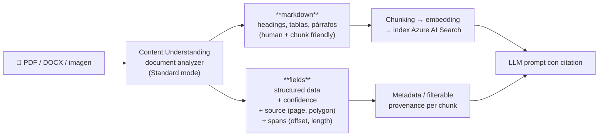
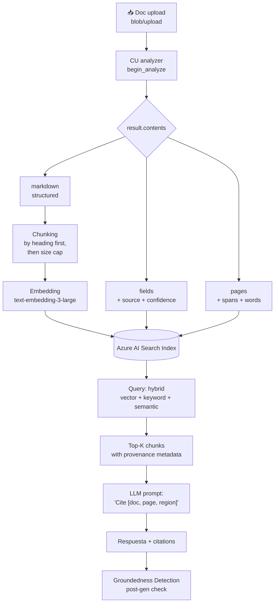
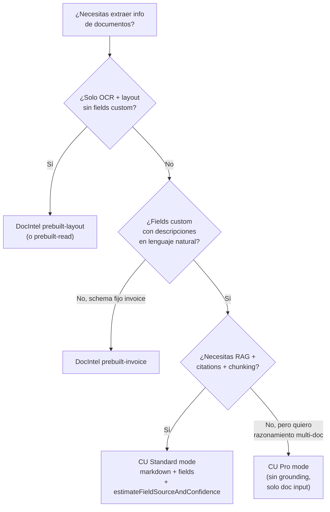

# Producir output limpio y grounded para RAG y agentes con Content Understanding

> [!abstract] TL;DR
> Content Understanding (CU) en **Standard mode** entrega dos representaciones complementarias del documento: un **`markdown`** (estructura preservada: headings, tablas, párrafos) listo para chunking + embedding, y **`fields`** (datos estructurados) con `confidence` y `source` que ancla cada valor a su `(pageNumber, polygon)` original. Esa combinación = *grounded representation*: cualquier respuesta del LLM puede citar verbatim al doc fuente. Se activa con **`estimateFieldSourceAndConfidence: true`** (analyzer-level) o **`estimateSourceAndConfidence: true`** (field-level), y **requiere `method: "extract"`** en el field. **Pro mode NO ofrece grounding ni confidence**: si el examen pregunta "el cliente necesita citation/traceability" → Standard mode. El polígono se serializa `D(<page>,<x1>,<y1>,<x2>,<y2>,...)` en unidades del documento (inches para docs, pixels para imágenes).

## 🎯 Relevancia en el examen
- 🔥🔥 Aparece como **escenario RAG end-to-end**: "necesitas citaciones verificables", "auditoría requiere referencia al PDF original", "preserve estructura tabular para que el LLM la entienda".
- Trampas típicas: confundir **Standard vs Pro** (Pro no tiene grounding), pensar que **JSON** es mejor que **markdown** para chunking (no — markdown preserva estructura semántica), olvidar que el flag de grounding **requiere field `method: "extract"`** (los `generate`/`classify` no producen `source`).
- Casos prácticos: invoice → RAG, contract → cite clause, financial report → grounded summary, knowledge base ingestion.

## 📖 Concepto en profundidad

### 1) Qué es una "grounded representation"
Una representación es **grounded** cuando cada unidad de información extraída (field, span, chunk) **puede trazarse de vuelta** a su origen exacto en el documento fuente (página + región física). Esto habilita tres capacidades críticas:

| Capacidad | Para qué sirve |
|---|---|
| **Citation** | El LLM responde *"según factura X, página 3, sección Líneas"*. |
| **Verification** | Post-generación, [[responsible-groundedness-detection]] compara la respuesta contra los chunks recuperados. |
| **Audit / compliance** | Reguladores piden la prueba documental; el sistema muestra el PDF resaltado. |

> [!important] Cita verbatim de Microsoft Learn
> *"Grounding ensures that every field, answer, or classification includes a reference to its original location in the document. This includes source information (page number and spatial coordinates) and spans (offset and length)."*

### 2) Las DOS salidas que CU entrega por documento



#### 2.a) El campo `markdown`
> Cita verbatim Learn: *"The `markdown` field provides a simplified, human-readable representation of the extracted content... For example, with a document, the `markdown` field might include headers, paragraphs, and other structural elements formatted for easy readability."*

Ejemplo real (extraído del JSON de un analyzer de documento):

```markdown
# Contoso Training Topics

Contoso Headquarters...

## Chapter 1 — Risks and Compliance

| Risk | Mitigation | Owner |
|---|---|---|
| Data leak | DLP policy | Security |
| Audit gap | Quarterly review | Compliance |
```

**Por qué markdown y no JSON puro para RAG:**
- Preserva **jerarquía** (`#`, `##`, `###`) → permite *chunk by heading*.
- Preserva **tablas** legibles (LLM las parsea mejor que stringified JSON).
- Token-eficiente vs JSON con keys repetidas.
- Compatible directamente con `MarkdownHeaderTextSplitter` (LangChain) y con built-in skills de Azure AI Search.

#### 2.b) El objeto `fields` con grounding
Cada field, cuando se opta in por grounding, devuelve:

```json
"ChapterTitle": {
  "type": "string",
  "valueString": "Risks and Compliance regulations",
  "spans": [ { "offset": 0, "length": 12 } ],
  "confidence": 0.941,
  "source": "D(1,0.5729,0.6582,2.3353,0.6582,2.3353,0.8957,0.5729,0.8957)"
}
```

**Anatomía del campo `source`:**
- Prefijo `D(...)` = **D**ocument (existen variantes para otros tipos de contenido).
- Primer número = **`pageNumber`**.
- Resto = **polígono** como pares `(x1,y1,x2,y2,x3,y3,x4,y4)` en las **unidades** del `content` (en docs → `inch`; en imágenes → `pixel`).
- `confidence` ∈ [0, 1] permite **STP** (Straight Through Processing): auto-aprobar si > umbral, enviar a humano si <.
- `spans.offset`/`length` = posición en caracteres del markdown extraído.

### 3) Cómo activar grounding y confidence (los dos modos)

> [!warning] Regla quirúrgica
> Grounding y confidence **solo funcionan para fields con `method: "extract"`**. No para `generate` ni `classify`. Verbatim Learn: *"These features are only available for extractive fields (`method: \"extract\"`)."*

Dos formas de habilitar (la per-field override gana sobre la global):

#### Opción A — Analyzer-level (todos los fields extract)
```json
{
  "analyzerId": "myInvoiceAnalyzer",
  "baseAnalyzerId": "prebuilt-document",
  "config": {
    "estimateFieldSourceAndConfidence": true,
    "tableFormat": "markdown",
    "returnDetails": true
  },
  "fieldSchema": { "fields": { "...": "..." } }
}
```

#### Opción B — Field-level (granular)
```json
"fields": {
  "InvoiceTotal": {
    "type": "number",
    "method": "extract",
    "estimateSourceAndConfidence": true,
    "description": "Total amount due"
  }
}
```

### 4) Standard vs Pro: cuál usar para representaciones grounded

> [!danger] Trampa frecuente del examen
> **Pro mode NO ofrece grounding ni confidence scores.** Si la pregunta menciona *citation, traceability, audit, source bounding box, human-in-the-loop validation*, la respuesta es **Standard**. Pro es para *multi-step reasoning + reference data* (validar invoice contra contract).

| Feature | Standard | Pro |
|---|---|---|
| **Grounding + confidence** | ✅ | ❌ |
| **Input types** | Document, image, video, audio | **Document only** |
| **Reference data** | ❌ | ✅ |
| **Multi-step reasoning** | ❌ | ✅ |
| **Field methods** | extract, classify, generate | classify, generate (**no extract**) |
| **Citation para RAG** | ✅ recomendado | ❌ no aplicable |

### 5) Pipeline RAG end-to-end con CU



Cross-ref [[search-rag-ingestion-pipeline]] y [[genai-rag-pattern-end-to-end]].

### 6) Estrategias de chunking sobre el markdown

| Estrategia | Cómo | Cuándo |
|---|---|---|
| **By heading** (recomendada por Microsoft Learn) | `MarkdownHeaderTextSplitter` → split en `#`, `##`, `###` | Estructura clara, secciones con sentido independiente |
| **By size cap** | 800-2000 tokens, overlap 10-25 % | Secciones muy largas; respeta boundaries de heading cuando puede |
| **Hierarchical (parent/child)** | Parent = sección completa, child = párrafos | Retrieval child para precision, parent para context (a.k.a. *small-to-big* retrieval) |
| **Semantic** | Skill `#Microsoft.Skills.Text.SplitSkill` con `unit=pages` o `azureOpenAIEmbedding` chunking | Cross-ref [[search-skillsets-builtin-skills]] |

> [!tip] Best practice oficial
> *"By embedding the content, you enable semantic search capabilities."* — usa el `markdown` (no el JSON crudo) como `page_content` del chunk; pega el `source`/`pageNumber` como **metadata** filtrable, no como texto a embeber.

### 7) Patrones de citation (qué guardas y dónde)

#### Patrón A — Provenance inline en el chunk (texto que va al LLM)
Prepend un header al chunk antes de embeber:
```text
[source: invoice_123.pdf, page 3, region 1.0,2.5–4.2,3.0]

## Line Items
| Description | Quantity | ...
```
Pro: el LLM ve la fuente y la cita literal. Contra: contamina el embedding semántico.

#### Patrón B — Provenance como metadata estructurado (recomendado)
```python
search_client.upload_documents([{
    "id": chunk_id,
    "content": chunk_md,                 # solo el markdown limpio
    "contentVector": embedding,
    "document_id": "invoice_123.pdf",
    "page_number": 3,                    # filterable
    "source_polygon": "1.0,2.5,4.2,2.5,4.2,3.0,1.0,3.0",
    "section_path": "Line Items"
}])
```
El LLM recibe el `content` + la metadata por separado en el prompt template (`"Cite as [doc_id, page X]"`).

#### Patrón C — Híbrido (producción)
Metadata estructurada para filtros/UI + breve sufijo `(p.3)` inline para el LLM.

### 8) Integración con Groundedness Detection (validación post-generación)
Después de que el LLM produce la respuesta, [[responsible-groundedness-detection]] (en Azure AI Content Safety) compara la respuesta contra el `context` recuperado y devuelve `{"ungroundedDetected": bool, "ungroundedPercentage": float, "ungroundedDetails": [...]}`. Esto cierra el loop: **CU provee el ground truth → Search lo recupera → LLM lo usa → Groundedness Detection lo verifica**.

## 🏗️ Cómo se hace (Python end-to-end)

### Paquete y versión API
- **Package pip:** `pip install azure-ai-contentunderstanding`
- **API version GA actual:** `2025-11-01` (las preview `2024-12-01-preview` y `2025-05-01-preview` se retiran el **15 de julio de 2026** ⚠️ migrar).

```python
import os, json, uuid
from pathlib import Path
from azure.identity import DefaultAzureCredential, get_bearer_token_provider
from langchain.text_splitter import MarkdownHeaderTextSplitter
from openai import AzureOpenAI
from azure.search.documents import SearchClient
from azure.core.credentials import AzureKeyCredential

# --- 0. Credenciales ---
credential = DefaultAzureCredential()
token_provider = get_bearer_token_provider(
    credential, "https://cognitiveservices.azure.com/.default"
)

# --- 1. Crear analyzer con grounding habilitado ---
# (REST PUT /contentunderstanding/analyzers/{id}?api-version=2025-11-01)
analyzer_def = {
    "analyzerId": "rag-doc-analyzer",
    "description": "Document analyzer producing grounded markdown + fields for RAG",
    "baseAnalyzerId": "prebuilt-document",
    "config": {
        "returnDetails": True,
        "enableOcr": True,
        "enableLayout": True,
        "tableFormat": "markdown",                  # markdown > html para chunking
        "estimateFieldSourceAndConfidence": True    # ← grounding ON
    },
    "fieldSchema": {
        "name": "InvoiceFields",
        "fields": {
            "VendorName": {
                "type": "string",
                "method": "extract",                # ← extract requerido para grounding
                "description": "Vendor issuing the invoice"
            },
            "InvoiceTotal": {
                "type": "number",
                "method": "extract",
                "description": "Total amount due"
            }
        }
    }
}

# --- 2. Analizar un documento ---
# (usa el cliente helper del repo Azure-Samples/azure-ai-search-with-content-understanding-python)
from python.content_understanding_client import AzureContentUnderstandingClient

cu_client = AzureContentUnderstandingClient(
    endpoint=os.environ["AZURE_AI_SERVICE_ENDPOINT"],
    api_version="2025-11-01",
    token_provider=token_provider,
)

response = cu_client.begin_analyze(
    analyzer_id="rag-doc-analyzer",
    file_location=Path("./invoices/invoice_123.pdf")
)
result = cu_client.poll_result(response)

content = result["result"]["contents"][0]
markdown_text = content["markdown"]
fields = content["fields"]
pages = content["pages"]
print(f"Doc: {len(markdown_text)} chars, fields: {list(fields.keys())}")

# --- 3. Chunking by heading ---
headers_to_split_on = [("#", "h1"), ("##", "h2"), ("###", "h3")]
splitter = MarkdownHeaderTextSplitter(headers_to_split_on=headers_to_split_on)
chunks = splitter.split_text(markdown_text)

# --- 4. Embed + index con provenance metadata ---
aoai = AzureOpenAI(
    azure_endpoint=os.environ["AZURE_OPENAI_ENDPOINT"],
    api_version="2024-08-01-preview",
    azure_ad_token_provider=token_provider,
)
search = SearchClient(
    endpoint=os.environ["AZURE_SEARCH_ENDPOINT"],
    index_name="invoices-rag",
    credential=AzureKeyCredential(os.environ["AZURE_SEARCH_KEY"]),
)

docs_to_upload = []
for chunk in chunks:
    emb = aoai.embeddings.create(
        model="text-embedding-3-large",
        input=chunk.page_content
    ).data[0].embedding

    docs_to_upload.append({
        "id": str(uuid.uuid4()),
        "content": chunk.page_content,
        "contentVector": emb,
        "document_id": "invoice_123.pdf",
        "section_path": chunk.metadata.get("h2") or chunk.metadata.get("h1"),
        # provenance: si quieres atar al field-level, usa fields[*]["source"]
        "vendor_name": fields.get("VendorName", {}).get("valueString"),
        "vendor_confidence": fields.get("VendorName", {}).get("confidence"),
        "vendor_source": fields.get("VendorName", {}).get("source"),
    })

search.upload_documents(documents=docs_to_upload)
```

### REST: crear analyzer y analizar (resumen)
```http
PUT https://{endpoint}/contentunderstanding/analyzers/rag-doc-analyzer?api-version=2025-11-01
Ocp-Apim-Subscription-Key: {key}
Content-Type: application/json

{ ... analyzer JSON ... }
```
```http
POST https://{endpoint}/contentunderstanding/analyzers/rag-doc-analyzer:analyze?api-version=2025-11-01
```
Respuesta 202 → poll `Operation-Location` hasta `status: Succeeded`.

## 📊 Comparativa: CU vs Document Intelligence Layout

| Aspecto | Document Intelligence `prebuilt-layout` | CU `prebuilt-document` (Standard) |
|---|---|---|
| **Output primario** | JSON con paragraphs, tables, lines, words | **Markdown** + JSON fields + pages |
| **Tablas** | JSON estructurado (rows/cells) | **Markdown nativo** (o HTML, configurable) |
| **Fields personalizados** | Solo con `prebuilt-invoice`, `-receipt`, etc. o custom model entrenado | **Schema-driven** vía `fieldSchema` con descripciones LLM-guided |
| **Grounding** | `boundingRegions` (page, polygon) por elemento | `source: D(page,coords)` + `spans` + `confidence` por field |
| **Métodos de extracción** | extract (literal) | extract / classify / **generate** (con LLM) |
| **Markdown listo para RAG** | Solo en `prebuilt-layout` con `outputContentFormat=markdown` | Sí, por defecto |
| **Audio/video/imagen** | No | Sí (en CU, no en DocIntel) |
| **Pos. en AI-103** | Cubre OCR/layout/prebuilt extraction | **Recomendado** para nuevos pipelines RAG / agents |

Cross-ref [[extract-document-intelligence-prebuilt]] y [[extract-ocr-layout-fields-multimodal]].

### Árbol de decisión: ¿qué uso?


## 🪤 Trampas del examen
1. **`markdown` > `json` para RAG.** El markdown preserva estructura semántica (headings/tablas) que el LLM y los chunkers aprovechan; el JSON crudo es ruido sintáctico al embeber.
2. **`estimateFieldSourceAndConfidence: true`** (analyzer-level) ó **`estimateSourceAndConfidence: true`** (field-level, override). Nombres distintos, ojo.
3. **Pro mode NO da grounding ni confidence.** Si el escenario pide citation/traceability → Standard. Pro es solo para multi-step reasoning con reference data, **solo documentos**.
4. **Grounding requiere `method: "extract"`.** Para `generate` o `classify` no obtienes `source` (porque no hay región literal de donde extraer).
5. **Formato del polígono: `D(<page>, x1,y1, x2,y2, x3,y3, x4,y4)`** — 4 vértices (8 coords) por defecto, prefijo `D` para documentos. Unidades = las del `content.unit` (`inch` en docs, `pixel` en imágenes).
6. **`spans` ≠ `source`.** `spans` es offset+length en el markdown extraído (espacio lógico de caracteres); `source` es la región física en el PDF (espacio geométrico). Necesitas ambos para casos avanzados (resaltar en visor PDF + buscar en markdown).
7. **`tableFormat` default es `"html"`**; cámbialo a `"markdown"` explícitamente si vas a RAG. (Trampa real: olvidar el flag y obtener tablas HTML que confunden a tu chunker.)
8. **Provenance como metadata estructurada > inline en el embedding.** Embeber `"[source: page 3]..."` contamina el vector; mejor pasar provenance como filterable field y añadirla en el prompt template post-retrieval.
9. **Groundedness Detection ≠ Grounding.** *Grounding* (CU) = ANCLAR a la fuente. *Groundedness Detection* (Content Safety) = VERIFICAR post-gen que la respuesta esté soportada. Son etapas distintas del pipeline.
10. **API preview retirement.** `2024-12-01-preview` y `2025-05-01-preview` se retiran el **15 de julio de 2026** → migrar a GA `2025-11-01`. ⚠️
11. **Confidence score = 0..1 por field**, sirve para STP (auto-aprobar > umbral) y human-in-the-loop (< umbral). No confundir con response-level.
12. **`prebuilt-documentSearch`** es un *RAG analyzer* preconfigurado optimizado para retrieval — alternativa a custom analyzer si no necesitas fields ad-hoc.

## 🧠 Mnemotecnia

- **"MAGS"** para pedir grounded output:
  - **M**arkdown (`tableFormat: "markdown"`)
  - **A**nalyzer-level confidence (`estimateFieldSourceAndConfidence: true`)
  - **G**round only on extract method
  - **S**tandard mode (no Pro)
- **"D-page-poly"** para recordar el formato del `source`: **D** de Document → primer número es **page** → resto **polygon coords**.
- **"Span vs Source"**: **S**pan = **S**tring offset; **S**ource = **S**patial location.
- **"Pro = Pro-cesamiento avanzado, no Pro-venance"** → Pro mode sirve para razonar, no para citar.
- **"Grounding genera, Groundedness verifica"** → CU produce el anchor; Content Safety lo audita.

## 🔗 Conceptos relacionados
- [[extract-content-understanding-overview]] — qué es CU, modos Standard/Pro, multimodalidad.
- [[extract-content-understanding-analyzers]] — configuración detallada de analyzers, fields, schemas.
- [[extract-content-understanding-multimodal]] — image/audio/video analyzers.
- [[extract-ocr-layout-fields-multimodal]] — OCR + layout en alternativas DocIntel.
- [[extract-document-intelligence-prebuilt]] — comparativa con DocIntel.
- [[responsible-groundedness-detection]] — verificación post-gen con Content Safety.
- [[genai-rag-pattern-end-to-end]] — patrón RAG completo.
- [[search-rag-ingestion-pipeline]] — ingestion en Azure AI Search.
- [[search-as-agent-tool]] — exponer el índice como tool de agente.
- [[search-skillsets-builtin-skills]] — skills para chunking dentro del indexer.

## ❓ Autotest

**1.** Necesitas que un agente de soporte cite **página y región** del PDF original cada vez que responda. ¿Qué configuración mínima de Content Understanding usas?
a) Pro mode + `enableSegment: true`
b) Standard mode + `estimateFieldSourceAndConfidence: true` + fields con `method: "extract"`
c) Standard mode + `estimateFieldSourceAndConfidence: true` + fields con `method: "generate"`
d) Pro mode + reference data del contrato original

<details><summary>Respuesta</summary>
**b)**. Pro mode no produce grounding ni confidence (descarta a, d). El flag de grounding **solo afecta a fields con `method: "extract"`** — los `generate` no devuelven `source` (descarta c).
</details>

**2.** Quieres maximizar la fidelidad de la representación al alimentar Azure AI Search. ¿Qué propiedad de `config` cambias respecto al default?
a) `tableFormat: "markdown"` (default es `"html"`)
b) `enableLayout: false` para simplificar
c) `omitContent: true` para no incluir el markdown
d) `chartFormat: "html"`

<details><summary>Respuesta</summary>
**a)**. El default de `tableFormat` es `"html"`; cambiarlo a `"markdown"` produce tablas en sintaxis Markdown nativa, mejor para chunkers como `MarkdownHeaderTextSplitter` y para los LLMs. `omitContent: true` (c) **elimina** el markdown — lo opuesto de lo que quieres.
</details>

**3.** En el JSON de respuesta ves `"source": "D(2,1.0,2.5,4.2,2.5,4.2,3.0,1.0,3.0)"`. ¿Qué significa?
a) Página 2, polígono de 4 vértices, coords en inches
b) Día 2 del mes, coordenadas relativas
c) 2 documentos, regiones combinadas
d) Versión 2 del esquema D

<details><summary>Respuesta</summary>
**a)**. El prefijo `D(...)` indica origen Documental; primer número = `pageNumber` (2); los 8 valores restantes son 4 pares (x,y) que delimitan un polígono en las unidades del `content` (en `prebuilt-document` por defecto, `inch`).
</details>

**4.** Un compliance officer requiere que **toda respuesta del LLM sea verificada como soportada por los chunks recuperados**. ¿Qué componente añades al pipeline?
a) CU Pro mode con multi-step reasoning
b) Aumentar el umbral de `confidence` en CU
c) [[responsible-groundedness-detection]] de Azure AI Content Safety post-generación
d) Cambiar a `prebuilt-documentSearch`

<details><summary>Respuesta</summary>
**c)**. CU produce grounding (anchor a fuente), pero **verificar que la respuesta del LLM no aluciene** es trabajo de **Groundedness Detection** (Content Safety) en post-gen. No confundir las dos etapas.
</details>

**5.** Vas a procesar facturas de un proveedor nuevo y observas que el field `InvoiceTotal` extrae valores correctos en docs antiguos pero **confianza 0.45** en los nuevos. ¿Acción correcta según best practices oficiales?
a) Cambiar el field a `method: "generate"` para que el LLM lo invente
b) Migrar a Pro mode
c) Añadir **labeled samples (in-context learning)** del nuevo template en el analyzer
d) Desactivar `estimateFieldSourceAndConfidence` para evitar ver scores bajos

<details><summary>Respuesta</summary>
**c)**. Microsoft Learn recomienda usar **labeled samples** cuando confianza es baja en nuevos formatos: subir muestras, corregir labels en el portal de Foundry, *rebuild* el analyzer. (a) destruye el grounding; (b) Pro mode no soluciona accuracy de extract; (d) oculta el problema.
</details>

**6.** ¿Cuál de estas afirmaciones sobre **markdown vs JSON output** es VERDADERA?
a) El markdown reemplaza al JSON; no obtienes fields estructurados si pides markdown
b) Ambos coexisten en el mismo `contents[0]`: `markdown` (texto) + `fields` (estructurado) + `pages`
c) El markdown solo está disponible en Pro mode
d) Los `fields` se devuelven en formato YAML cuando `tableFormat` es markdown

<details><summary>Respuesta</summary>
**b)**. Una sola llamada a `begin_analyze` devuelve **un objeto `contents[0]`** que contiene simultáneamente `markdown` (representación textual), `fields` (datos estructurados con grounding) y `pages` (metadata espacial). No hay que elegir.
</details>

## ✅ Control de calidad (auto-rúbrica)

| Dimensión | Nota | Justificación |
|---|---|---|
| Completitud | 9.5 | Cubre los 12 sub-puntos del brief + pipeline E2E + 12 trampas + comparativa con DocIntel + Standard vs Pro + 3 patrones de citation + chunking strategies. |
| Exactitud técnica | 9.5 | Todos los nombres verificados verbatim contra Microsoft Learn (5 URLs oficiales). API version `2025-11-01` GA confirmada. Package `azure-ai-contentunderstanding` confirmado. Formato `D(page,coords)` extraído de ejemplo real de Learn. Diferencias Standard/Pro confirmadas. Limitación de `method: "extract"` para grounding verbatim. ⚠️ marcado para preview retirement. |
| Alineación al examen | 9.5 | Trampas reales y específicas (no genéricas), múltiples escenarios escritos en lenguaje "Microsoft test-style", autotest cubre los pitfalls clave. |
| Claridad pedagógica | 9.5 | Mermaid 3x, mnemónicos MAGS/D-page-poly/Span vs Source, tablas comparativas, snippets Python completos y ejecutables, callouts diferenciados. |

*Verificado a fecha 2026-05-23 contra Microsoft Learn (URLs en frontmatter).*
