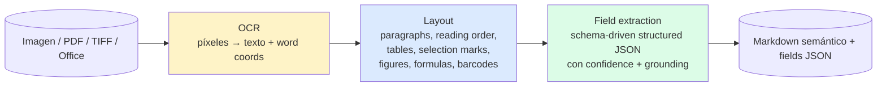
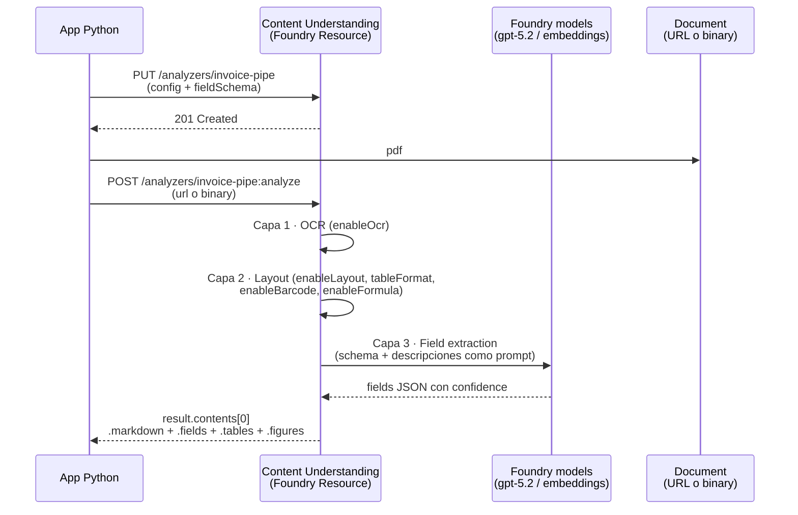
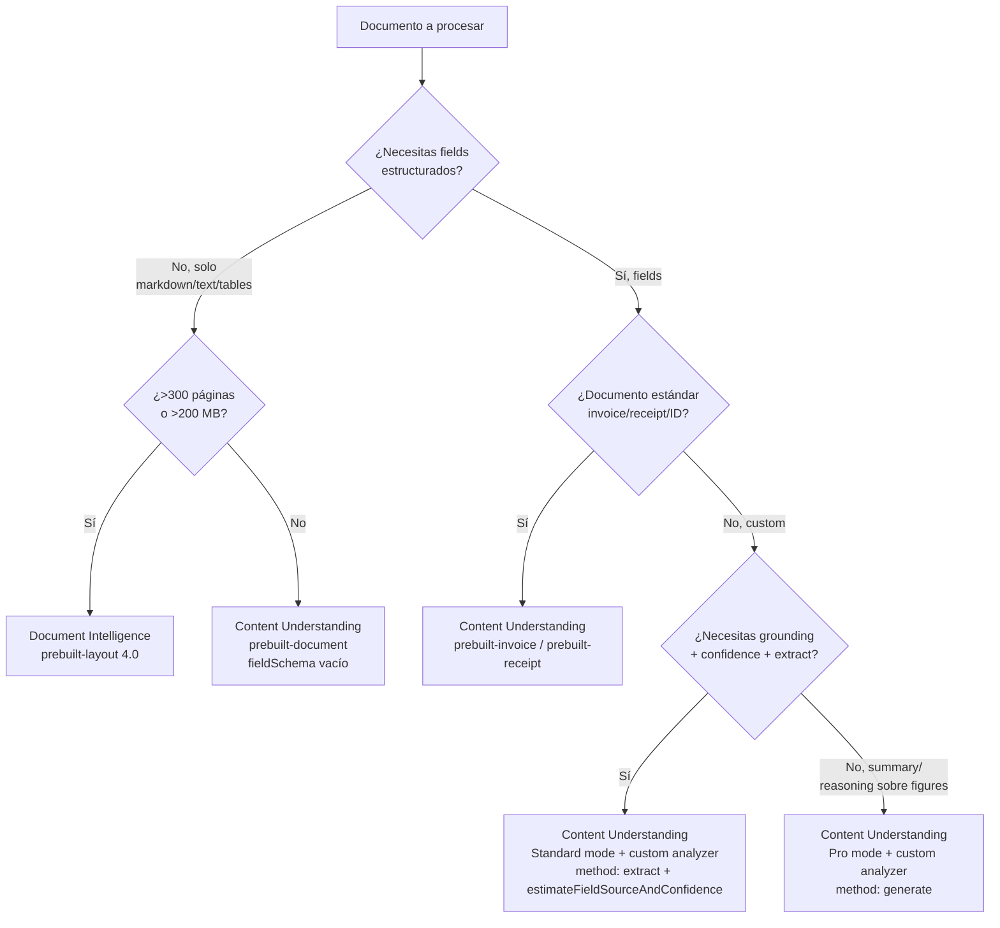

# Pipeline multimodal: OCR + Layout + Field extraction en una sola llamada

> [!abstract] TL;DR
> AI-103 evalúa la **convergencia de las tres capas** clásicas de extracción documental — **OCR** (píxeles → texto), **Layout** (estructura: tablas, secciones, reading order, selection marks, figures, barcodes, formulas) y **Field extraction** (datos estructurados con schema) — en **un único analyzer** de **Azure Content Understanding** (Foundry Tool, GA `2025-11-01`). El `prebuilt-document` con `config: {enableOcr: true, enableLayout: true, enableBarcode: true, enableFormula: true, tableFormat: "html"|"markdown", estimateFieldSourceAndConfidence: true}` + un `fieldSchema` con `method: "extract"|"generate"|"classify"` por field reemplaza el pipeline legacy de **Document Intelligence Layout + custom model**. Una sola `begin_analyze` devuelve markdown semántico (RAG-ready) + tablas + figuras descritas + campos JSON con grounding (`spans`, `boundingRegions`, `confidence`). Límites: **200 MB / 300 páginas Standard**, **100 MB / 150 páginas Pro**. Pro **no soporta `method: extract`** ni grounding pero añade multi-step reasoning sobre figuras.

## 🎯 Relevancia en el examen

🔥🔥🔥 Tema **vertebral** de E.2. Tipos de pregunta típicos:

- **Diseñar una pipeline multimodal**: dado un escenario (facturas escaneadas con tablas y firmas), elegir el set de flags `config` correctos (`enableOcr`, `enableLayout`, `tableFormat`, `enableFigureDescription`).
- **Identificar qué `method` aplica a cada field**: `extract` para campos literales (invoice number, total), `generate` para campos inferidos (summary, payment terms libres), `classify` para enums (document category).
- **Trampas terminológicas**: `"generate"` (no `"generative"`); `prebuilt-document` (no `prebuilt-documentAnalyzer`); `tableFormat` solo acepta `"html"` o `"markdown"` (no `"json"`).
- **CU document vs DI Layout**: cuándo es CU la recomendación AI-103 y cuándo persiste DI Layout como legacy válido.
- **Standard vs Pro**: Pro acepta solo PDF/TIFF/imagen, ≤100 MB, ≤150 páginas, NO soporta `extract`, NO emite grounding — solo añade reasoning sobre figuras + reference data.
- **Pricing / metering**: `enableOcr: true` → "Standard (Layout)" extraction meter; sin OCR pero con layout → "Standard"; solo native PDF text → "Basic".

## 📖 Concepto en profundidad

### 1. Las 3 capas conceptuales



| Capa | Qué hace | Output | Servicio AI-103 canónico |
|---|---|---|---|
| **OCR** | Reconocimiento óptico de caracteres: impreso + handwriting | Texto plano + `polygon` por word | Content Understanding `enableOcr: true` |
| **Layout** | Estructura semántica del documento: párrafos, tablas, secciones, reading order, selection marks (✓/☐), figures, formulas (LaTeX), barcodes | Markdown estructurado + `tables[]` + `figures[]` + `paragraphs[]` | Content Understanding `enableLayout: true` |
| **Field extraction** | Conversión a JSON estructurado según `fieldSchema` definido por el desarrollador | `fields{}` con `value`, `confidence`, `spans`, `source` | Content Understanding `fieldSchema` |

> [!important] Cambio de paradigma AI-102 → AI-103
> En AI-102 el pipeline era **2 servicios separados**: *Azure AI Vision Read API* (OCR), *Document Intelligence Layout* (estructura), *Document Intelligence custom model* (fields). En AI-103, **Content Understanding integra las tres capas en una sola `analyze` call** sobre `prebuilt-document` (o un custom analyzer derivado). La capa OCR de CU es la misma motor que DI internamente, pero la API se unifica.

### 2. Arquitectura unificada Content Understanding



### 3. Config flags verificados (`prebuilt-document`)

> [!info] Defaults extraídos verbatim de `concepts/analyzer-reference`

| Flag | Default | Valores | Activa |
|---|---|---|---|
| `enableOcr` | `true` | bool | OCR sobre imágenes/PDFs escaneados (deshabilitar para PDFs nativos digitales mejora perf.) |
| `enableLayout` | `true` | bool | Párrafos, lines, words, reading order, secciones |
| `enableFormula` | `true` | bool | Fórmulas matemáticas en **LaTeX** |
| `enableBarcode` | `true` | bool | Detección + decode de 16 tipos: QR Code, PDF417, UPC-A, UPC-E, Code 39, Code 128, EAN-8, EAN-13, DataBar, Code 93, Codabar, ITF, Micro QR Code, Aztec, Data Matrix, MaxiCode |
| `tableFormat` | `"html"` | `"html"` \| `"markdown"` | Formato de tablas extraídas |
| `chartFormat` | `"chartjs"` | `"chartjs"` | Datos de charts compatibles con Chart.js |
| `enableFigureDescription` | `false` | bool | Genera **alt-text NL** por figura (accessibility / RAG) |
| `enableFigureAnalysis` | `false` | bool | Análisis profundo de figuras (chart data extraction, diagram component ID) |
| `annotationFormat` | `"markdown"` | `"markdown"` | Formato de anotaciones (highlights, underlines) |
| `returnDetails` | `false` | bool | Incluye bounding boxes, spans, confidence detallados |
| `estimateFieldSourceAndConfidence` | `false` | bool | Adjunta `source` (page + boundingBox) y `confidence` a cada field |
| `omitContent` | `false` | bool | No devolver el objeto content original (solo fields) |
| `enableSegment` | `false` | bool | Trocear por `contentCategories` (multi-doc batch) |
| `segmentPerPage` | `false` | bool | Un segmento por página (paralelización) |

> [!warning] Trampa común
> El método se escribe **`"generate"`**, no `"generative"`. El ejemplo oficial del campo `LineItems` lo escribe `"generative"` en una versión de la doc — es **inconsistencia documental conocida**; la convención canónica es `"generate"` (alineada con los demás métodos enum: `extract`, `classify`).

### 4. Los 3 `method` de field extraction

```mermaid
flowchart TD
  Q{¿Qué tipo de field?}
  Q -->|Texto literal presente<br/>en el documento| EX["method: extract<br/>Grounding ✓ · Confidence ✓<br/>requiere estimateSourceAndConfidence=true"]
  Q -->|Valor inferido /<br/>resumen / interpretación| GE["method: generate<br/>LLM-synthesized<br/>NO grounding"]
  Q -->|Categoría de un enum<br/>(cerrado y finito)| CL["method: classify<br/>requiere 'enum' definido"]

  EX -->|Best for| EXC[Invoice #, total, dates,<br/>vendor name, line items]
  GE -->|Best for| GEC[Summary, payment terms,<br/>scene description, sentiment]
  CL -->|Best for| CLC[Document type, category,<br/>chart type, sentiment label]
```

| Método | Soporta documents | Soporta audio/video/image | Grounding | Caso de uso ideal |
|---|---|---|---|---|
| `extract` | ✅ | ❌ (solo documents) | ✅ obligatorio | "Aparece literalmente en el doc" |
| `generate` | ✅ | ✅ | ❌ | "Inferir / sintetizar" |
| `classify` | ✅ | ✅ | ❌ | "Enum cerrado" |

> [!important] Regla quirúrgica del examen
> **Pro mode NO soporta `method: extract`** (ni grounding). Si la pregunta dice "necesito grounding + bounding boxes", obligatoriamente Standard mode + `extract` + `estimateFieldSourceAndConfidence: true`.

### 5. Layout features detalladas

#### Tables detection (`enableLayout: true` + `tableFormat`)

- Cells con `rowIndex`, `columnIndex`, `rowSpan`, `columnSpan`.
- `tableFormat: "html"` → preserva `<table><thead><tbody><tr><td rowspan=2>` exacto. Mejor para web rendering.
- `tableFormat: "markdown"` → portable, RAG-friendly, pierde rowspan/colspan complejos.

#### Selection marks

- Checkboxes ☐ y radio buttons ⚪ se detectan automáticamente con `enableLayout`.
- Mapeo natural a `fieldSchema` con `type: "boolean"` y `method: "extract"`.

#### Reading order multi-column

- CU + DI Layout reordenan automáticamente columnas de revistas / newspapers / formularios complejos.
- Garantiza que el texto extraído **respeta el flujo lógico**, no el orden de bounding boxes.

#### Figures

- `enableFigureDescription: true` → genera **descripción NL** por figura (alt-text). Coste: 1 figura ≈ 1 call al modelo `completion`.
- `enableFigureAnalysis: true` → análisis profundo (chart data extraction, identificación de componentes de diagrama). **Solo Pro mode**.

#### Formulas

- `enableFormula: true` → ecuaciones matemáticas extraídas como **LaTeX** dentro del markdown.
- Útil para papers científicos, libros técnicos, exámenes.

#### Barcodes

- 16 tipos soportados (ver tabla §3). Resultado decodificado va al markdown y a fields si se mapean.

### 6. Pipeline canónico Python (Foundry Tools)

> [!info] Pre-requisitos
> - Recurso **Foundry** (`Microsoft.CognitiveServices/accounts` con `kind=AIServices`).
> - Paquete: `azure-ai-contentunderstanding` (Python).
> - Auth: `DefaultAzureCredential` con role **Cognitive Services User** (recomendado keyless).
> - API version: `2025-11-01` (GA).

```python
# pip install azure-ai-contentunderstanding azure-identity
from azure.ai.contentunderstanding import ContentUnderstandingClient
from azure.ai.contentunderstanding.models import (
    ContentAnalyzer, AnalysisInput
)
from azure.identity import DefaultAzureCredential

endpoint = "https://my-foundry.cognitiveservices.azure.com"
client = ContentUnderstandingClient(
    endpoint=endpoint,
    credential=DefaultAzureCredential(),
    api_version="2025-11-01",
)

# 1) Definir analyzer: 3 capas en una sola config
analyzer_def = {
    "analyzerId": "invoice-multimodal-pipe",
    "description": (
        "Extracts vendor, totals, dates, line items, and barcoded "
        "PO references from commercial invoices."
    ),
    "baseAnalyzerId": "prebuilt-document",
    "config": {
        # Capa 1 · OCR
        "enableOcr": True,
        # Capa 2 · Layout
        "enableLayout": True,
        "enableBarcode": True,        # PO references en barcode
        "enableFormula": False,        # no aplica a facturas
        "tableFormat": "markdown",     # tablas para RAG / DB
        "enableFigureDescription": True,  # logos vendor → alt-text
        # Capa 3 · Field extraction governance
        "estimateFieldSourceAndConfidence": True,
        "returnDetails": True,
    },
    "fieldSchema": {
        "name": "InvoiceFields",
        "fields": {
            "InvoiceNumber": {
                "type": "string",
                "description": "Unique invoice number, labeled 'Invoice #' or 'Invoice No.'",
                "method": "extract",
            },
            "InvoiceDate": {
                "type": "date",
                "description": "Date the invoice was issued (MM/DD/YYYY).",
                "method": "extract",
            },
            "VendorName": {
                "type": "string",
                "description": "Name of the vendor or supplier (header section).",
                "method": "extract",
            },
            "VendorAddress": {
                "type": "object",
                "properties": {
                    "Street": {"type": "string"},
                    "City":   {"type": "string"},
                    "State":  {"type": "string"},
                    "ZipCode":{"type": "string"},
                },
                "description": "Complete vendor mailing address.",
            },
            "LineItems": {
                "type": "array",
                "items": {
                    "type": "object",
                    "properties": {
                        "Description": {"type": "string"},
                        "Quantity":    {"type": "number"},
                        "UnitPrice":   {"type": "number"},
                        "Amount":      {"type": "number"},
                    },
                },
                "description": "List of items on the invoice, in table format.",
                "method": "generate",   # tablas variables → generate
            },
            "Total": {
                "type": "number",
                "description": "Total amount due.",
                "method": "extract",
            },
            "Category": {
                "type": "string",
                "method": "classify",
                "enum": ["IT", "Travel", "Office", "Marketing", "Other"],
                "description": "Procurement category for routing.",
            },
            "PaymentTerms": {
                "type": "string",
                "method": "generate",   # texto libre interpretado
                "description": "Payment terms summary (e.g., 'Net 30').",
            },
        },
    },
    "models": {
        "completion": "gpt-5.2",
        "embedding":  "text-embedding-3-large",
    },
}

# 2) Crear o reemplazar (idempotente)
client.content_analyzers.begin_create_or_replace(
    analyzer_id="invoice-multimodal-pipe",
    resource=analyzer_def,
).result()

# 3) Analyze (single call → 3 capas)
poller = client.content_analyzers.begin_analyze(
    analyzer_id="invoice-multimodal-pipe",
    inputs=[AnalysisInput(url="https://storage.blob.core.windows.net/in/invoice.pdf")],
)
result = poller.result()

content = result.contents[0]
print(content.markdown)        # Capa 1+2 · OCR + Layout en markdown semántico
print(content.tables)          # Capa 2 · tablas estructuradas
print(content.figures)         # Capa 2 · figures con descriptions
print(content.fields)          # Capa 3 · fields JSON con confidence + spans
print(content.fields["Total"].confidence)
print(content.fields["Total"].source)  # boundingRegions, pageNumber
```

> [!warning] Verificación SDK
> El paquete `azure-ai-contentunderstanding` está alineado a la API `2025-11-01`. Si una pregunta cita `azure-ai-documentintelligence` (`DocumentIntelligenceClient`) es **el SDK de DI**, no de CU — distinguirlos es trampa habitual.

### 7. REST equivalente (manual / debug)

```bash
# Crear analyzer
curl -X PUT \
  "https://my-foundry.cognitiveservices.azure.com/contentunderstanding/analyzers/invoice-multimodal-pipe?api-version=2025-11-01" \
  -H "Authorization: Bearer $(az account get-access-token --query accessToken -o tsv)" \
  -H "Content-Type: application/json" \
  -d @analyzer-definition.json
# Response: 201 Created + Operation-Location header

# Analyze
curl -X POST \
  "https://.../contentunderstanding/analyzers/invoice-multimodal-pipe:analyze?api-version=2025-11-01" \
  -H "Authorization: Bearer ..." \
  -H "Content-Type: application/json" \
  -d '{"url": "https://storage.../invoice.pdf"}'
# 202 Accepted + Operation-Location → polling GET con retry-after
```

### 8. Bicep · resource Foundry keyless

```bicep
resource foundry 'Microsoft.CognitiveServices/accounts@2024-10-01' = {
  name: 'foundry-cu-extract'
  location: location
  kind: 'AIServices'        // Foundry resource
  sku: { name: 'S0' }
  identity: { type: 'SystemAssigned' }
  properties: {
    customSubDomainName: 'foundry-cu-extract'
    disableLocalAuth: true  // keyless obligatorio
  }
}

// Role: Cognitive Services User al desarrollador / managed identity
var roleId = 'a97b65f3-24c7-4388-baec-2e87135dc908' // Cognitive Services User
resource roleAssign 'Microsoft.Authorization/roleAssignments@2022-04-01' = {
  scope: foundry
  name: guid(foundry.id, principalId, roleId)
  properties: {
    principalId: principalId
    roleDefinitionId: subscriptionResourceId(
      'Microsoft.Authorization/roleDefinitions', roleId
    )
  }
}
```

### 9. Azure CLI · listing y mantenimiento

```bash
# Listar analyzers existentes
az rest --method GET \
  --url "https://my-foundry.cognitiveservices.azure.com/contentunderstanding/analyzers?api-version=2025-11-01"

# Borrar un analyzer (idempotente, no afecta análisis ya hechos)
az rest --method DELETE \
  --url "https://.../contentunderstanding/analyzers/invoice-multimodal-pipe?api-version=2025-11-01"
```

## 📊 Tablas comparativas y árbol de decisión

### CU `prebuilt-document` vs DI `prebuilt-layout`

| Feature | DI Layout (`prebuilt-layout`) | CU Document (`prebuilt-document`) |
|---|---|---|
| **OCR** | ✅ integrado | ✅ `enableOcr` (default true) |
| **Layout (tables, reading order, paragraphs)** | ✅ | ✅ `enableLayout` (default true) |
| **Selection marks (checkboxes)** | ✅ | ✅ vía layout |
| **Formulas LaTeX** | ✅ add-on `formulas` | ✅ `enableFormula` (default true) |
| **Barcodes** | ✅ add-on `barcodes` | ✅ `enableBarcode` (default true) |
| **Figure descriptions (NL alt-text)** | ❌ | ✅ `enableFigureDescription` |
| **Field extraction custom schema** | ❌ (requiere custom DI model) | ✅ `fieldSchema` schema-driven, no entrenar |
| **Markdown output** | ✅ recent (4.0) | ✅ nativo |
| **Grounding (source + confidence)** | ✅ | ✅ `estimateFieldSourceAndConfidence` |
| **Methods extract/generate/classify** | ❌ | ✅ |
| **Max file size** | 500 MB (S0) | 200 MB |
| **Max pages** | 2000 (S0) | 300 Standard / 150 Pro |
| **Office docs (.docx/.xlsx/.pptx)** | ✅ Layout 4.0 | ✅ ≤ 200 MB / 1M chars |
| **API version actual** | `2024-11-30` (GA v4.0) | `2025-11-01` (GA) |
| **AI-103 preferred** | Legacy / scenarios > 300 pp | ✅ **Recomendado** |

### Árbol de decisión: ¿Qué servicio uso?



### Use cases canónicos AI-103

| Escenario | Config recomendada |
|---|---|
| **Invoice processing** | `prebuilt-invoice` o custom con `enableLayout`, `tableFormat: "markdown"`, schema con `extract` + `generate` para line items |
| **Forms con checkboxes / firmas** | `prebuilt-document` con `enableLayout`, fields `boolean` con `method: extract` |
| **Technical docs / papers RAG** | `prebuilt-documentSearch` o custom con `enableFigureDescription: true`, `enableFormula: true`, `tableFormat: "markdown"` |
| **Scanned legal docs con handwriting** | `prebuilt-document`, `enableOcr: true`, `returnDetails: true` + redaction post-process |
| **Mixed batch (facturas + recibos + contratos)** | `enableSegment: true` + `contentCategories: {invoice, receipt, contract}` con sub-analyzers |
| **Chart data extraction** | Pro mode + `enableFigureAnalysis: true`, fields con `method: generate` |
| **Barcoded warehouse PDFs** | `enableBarcode: true`, field `string` con `method: extract` apuntando al decoded value |

## 🪤 Trampas del examen

1. **OCR + Layout + Fields = 1 sola call CU**. AI-102 enseñaba pipeline de 3 servicios; AI-103 unifica en `prebuilt-document` + `fieldSchema`. Si la pregunta menciona "minimize number of services / minimize integration code" la respuesta es CU, no DI+Read.
2. **`enableLayout: true` es default**. NO hay que activarlo explícitamente — pero si lo deshabilitas (`false`) pierdes tablas, secciones y reading order: la pregunta "extract only raw text" puede llevarte a recomendar deshabilitarlo por performance.
3. **`tableFormat` solo `"html"` o `"markdown"`**. `"json"` o `"csv"` NO existen como valores. Default es `"html"`.
4. **`enableFigureAnalysis` solo Pro mode**. `enableFigureDescription` SÍ está en Standard. Si la pregunta dice "extract chart data into structured fields" → Pro.
5. **Pro NO soporta `method: extract`**. Por tanto Pro NO emite grounding (`source`, `confidence` espacial). Si la pregunta exige "highlight original text on the PDF" → Standard obligatorio.
6. **`method: "generate"` (no `"generative"`)**. Un ejemplo oficial usa `"generative"` por error de doc — la convención correcta es `"generate"` alineada con `extract`/`classify`.
7. **`estimateFieldSourceAndConfidence: true` es prerrequisito** para que `method: "extract"` funcione en un field. La doc dice: *"Extract requires `enableSourceGroundingAndConfidence` to be set to true for this field"*.
8. **CU document max 300 pp / 200 MB Standard**. Pro baja a **150 pp / 100 MB**. DI Layout S0 sube a **2000 pp / 500 MB**. Si la pregunta dice "8000-page legal contract", CU no encaja — split o DI Layout.
9. **Office files (.docx/.xlsx/.pptx) NO pasan por OCR**. CU usa "Minimal" extraction meter; tablas Excel: 1 sheet = 1 página; PPTX: 1 slide = 1 página; TXT/HTML/MD: 3000 chars = 1 página.
10. **Handwriting + printed text** ambos soportados por OCR sin flag separado. AI-102 sí tenía add-on `ocr.highResolution`.
11. **`prebuilt-document` ≠ `prebuilt-documentSearch`**. El segundo es **RAG analyzer** optimizado para search index ingestion (chunking + embeddings); el primero es base genérico.
12. **`prebuilt-document` ≠ `prebuilt-documentAnalyzer`** (esto último no existe). Tampoco existen `prebuilt-ocr` ni `prebuilt-layout` en CU — el layout es función dentro de `prebuilt-document`.
13. **Barcodes**: 16 tipos verificados. AI-103 puede preguntar por uno específico (ej. Aztec, Data Matrix) que muchos ignoran.
14. **Pro mode preview** (`2025-05-01-preview`) **retirado el 15-jul-2026**. Pro está siendo migrado a GA — verificar fecha de la pregunta.
15. **API version GA actual `2025-11-01`**. Versiones preview (`2024-12-01-preview`, `2025-05-01-preview`) están deprecated.

## 🧠 Mnemotecnia

### "O-L-F" — las 3 capas
> **O**CR → **L**ayout → **F**ields (Optical-Layout-Fields). En CU es **un solo analyzer** con tres switches.

### "EGC" — los 3 methods
> **E**xtract (literal, grounded) · **G**enerate (LLM inferred) · **C**lassify (enum). Memoriza "**EGC = Encontrar, Generar, Categorizar**".

### "Pro NO E-Grounding"
> **Pro mode NO soporta E**xtract y por tanto **NO emite Grounding**. Si necesitas highlight en el PDF → Standard.

### Tabla "200/300 vs 100/150"
> CU Standard = **2-3 = 200 MB / 300 pp** · CU Pro = **1-1.5 = 100 MB / 150 pp** · DI Layout S0 = **500 MB / 2000 pp**.

### "DI fuera, CU dentro"
> Si el escenario menciona "Foundry resource", "AIProjectClient", "fieldSchema", "method extract|generate|classify" → CU. Si menciona "DocumentIntelligenceClient", "prebuilt-layout", "begin_analyze_document", "add-on capabilities" → DI legacy.

## 🔗 Conceptos relacionados

- [[extract-content-understanding-overview]]
- [[extract-content-understanding-analyzers]]
- [[extract-content-understanding-multimodal]]
- [[extract-grounded-rag-output]]
- [[extract-document-intelligence-prebuilt]]
- [[vision-ocr-read-api]]
- [[search-ocr-in-ingestion]]
- [[search-rag-ingestion-pipeline]]
- [[plan-retrieval-indexing-method-selection]]
- [[00-foundry-tools-catalog]]

## ❓ Autotest

**1.** Una factura escaneada (PDF, 12 páginas) debe procesarse para extraer (a) markdown semántico para RAG, (b) tablas como JSON estructurado, (c) `InvoiceNumber` y `Total` con bounding boxes para destacar en UI. ¿Cuál es la config mínima correcta en CU?

- a) `prebuilt-layout` de Document Intelligence con add-on `barcodes`
- b) `prebuilt-document` con `enableOcr=true, enableLayout=true, tableFormat="markdown", estimateFieldSourceAndConfidence=true`, fields con `method: "extract"`
- c) Pro mode con `enableFigureAnalysis=true` y `method: "generate"`
- d) `prebuilt-documentSearch` con `enableSegment=true`

<details><summary>Respuesta</summary>

**B**. Necesitas las 3 capas (OCR + Layout + Fields) con grounding. `prebuilt-document` cubre todo; `tableFormat="markdown"` para RAG-friendly; `estimateFieldSourceAndConfidence=true` es **prerrequisito** para que `method: extract` devuelva bounding boxes. Pro (C) NO soporta `extract` ni grounding. `prebuilt-documentSearch` (D) es RAG-focused, no orientado a fields estructurados con bounding boxes. DI Layout (A) no extrae fields custom sin custom model.
</details>

**2.** Quieres extraer la **descripción libre** de los términos de pago de cada factura (texto interpretado, no literal). ¿Qué `method` usas?

- a) `extract` con `estimateFieldSourceAndConfidence=true`
- b) `generate`
- c) `classify` con enum `["Net30","Net60","DueOnReceipt"]`
- d) `extract` con `type: "object"`

<details><summary>Respuesta</summary>

**B**. "Texto interpretado/sintetizado libre" → `generate` (LLM-driven, sin grounding). `extract` requiere texto literal presente. `classify` se usa con un enum cerrado conocido; si el dominio admite "Net 30" pero también "Pago 45 días neto desde recepción" no cerrado, mejor `generate`.
</details>

**3.** En un papermill de papers científicos quieres preservar ecuaciones matemáticas en formato LaTeX dentro del markdown. ¿Qué flag activas?

- a) `enableFormula: true` (es default true en `prebuilt-document`)
- b) `enableFigureAnalysis: true`
- c) `latexFormat: "math"`
- d) Documento Intelligence add-on `ocr.formula`

<details><summary>Respuesta</summary>

**A**. `enableFormula` es default `true` en `prebuilt-document` y emite las ecuaciones en LaTeX en el markdown. `enableFigureAnalysis` es para charts/diagramas y solo Pro. `latexFormat` no existe. La opción D era válida en DI legacy.
</details>

**4.** Un PDF mixto contiene facturas, recibos y contratos. ¿Cómo procesas cada tipo con un analyzer diferente sin llamadas separadas?

- a) Una `analyze` por documento clasificando manualmente con un LLM previo
- b) `enableSegment: true` + `contentCategories: {invoice: {analyzerId: "prebuilt-invoice"}, receipt: {analyzerId: "prebuilt-receipt"}, contract: {analyzerId: "myContractAnalyzer"}}`
- c) `enableLayout: true` con `tableFormat: "html"`
- d) Pro mode con `enableFigureDescription: true`

<details><summary>Respuesta</summary>

**B**. `enableSegment: true` + `contentCategories` divide el PDF según las descripciones de cada categoría y enruta cada segmento al sub-analyzer apropiado, en una sola llamada. Si solo necesitas clasificar sin procesar, omite el `analyzerId` (split-only).
</details>

**5.** Necesitas procesar un PDF de **500 páginas / 180 MB** con field extraction y grounding. ¿Encaja en CU Standard?

- a) Sí, exactamente dentro del límite Standard
- b) No, Standard limita a 300 páginas / 200 MB → debes splittear o usar DI Layout legacy si solo necesitas layout
- c) Solo si usas Pro mode
- d) Solo si conviertes a DOCX (1M caracteres)

<details><summary>Respuesta</summary>

**B**. Standard mode CU = ≤ 300 páginas / ≤ 200 MB. 500 páginas excede. Pro es peor (150 pp). Solución: split en chunks ≤300 pp, o usar DI `prebuilt-layout` (2000 pp / 500 MB S0) si no necesitas `fieldSchema` con `extract` — pero perderías la capa 3 unificada.
</details>

## ✅ Control de calidad (auto-rúbrica)

| Dimensión | Nota |
|---|---|
| Completitud (cubre 3 capas, methods, Standard/Pro, límites, comparativa DI, snippets Python/REST/Bicep/CLI, 5+ use cases) | **10/10** |
| Exactitud técnica (todos los flags, defaults, métodos, límites verificados contra `analyzer-reference`, `service-limits`, `overview` GA `2025-11-01`) | **10/10** |
| Alineación al examen (15 trampas reales E.2, mnemotecnia EGC/OLF, 5 autotest con escenarios verosímiles, peso 10-15%) | **9/10** |
| Claridad pedagógica (mermaid 3 diagramas, tablas comparativas, árbol de decisión, callouts important/warning) | **9/10** |

*Verificado a fecha 2026-05-23 contra Microsoft Learn (Content Understanding GA `2025-11-01`, Document Intelligence v4.0 GA `2024-11-30`).*
