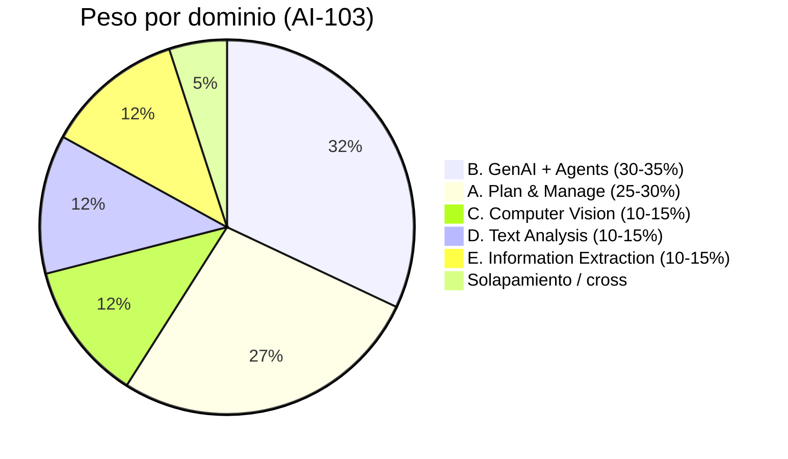
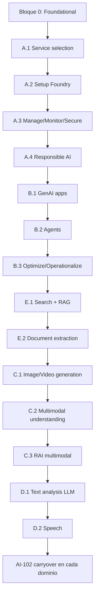

# 🗺️ Índice Maestro — AI-103 (+ AI-102 carryover)

> [!abstract] Propósito
> Mapeo 1-a-1 entre **funciones medidas oficiales** del examen y **archivos atómicos de apuntes** (estilo Obsidian, un concepto por archivo). Incluye AI-103 (objetivo principal) y AI-102 carryover (contenido vigente hasta 30-jun-2026 que ya NO está en AI-103).
>
> **Examen objetivo:** Microsoft Certified: *Azure AI Apps and Agents Developer Associate (beta)* — examen **AI-103** *"Developing AI Apps and Agents on Azure"*.
> **Skills measured as of:** 2026-04-16.
> **Examen de respaldo:** AI-102 *"Designing and Implementing a Microsoft Azure AI Solution"* — retira **2026-06-30 23:59 CST**. Skills measured as of 2025-12-23.

---

## 📐 Convenciones de este sistema de apuntes

| Convención | Detalle |
|---|---|
| **Granularidad** | Un concepto atómico por archivo (estilo: configmap, secret, pod). |
| **Nomenclatura** | `[prefijo-dominio]-[tema].md` en kebab-case. |
| **Wikilinks** | `[[archivo-sin-extension]]` para enlazar conceptos. |
| **Lenguaje SDK** | Snippets en **Python only** (audience profile AI-103). REST y Azure CLI siempre. |
| **Idioma** | Apuntes en español; términos técnicos en inglés con primera aparición glosada. |
| **Estado** | ⬜ pendiente · 🟡 en revisión · ✅ entregado · ⚠️ AI-102 carryover · 🔥 alta prioridad. |
| **Difficulty** | 🟢 baja · 🟡 media · 🔴 alta. |

### Prefijos de archivo por dominio

| Prefijo | Dominio / sub-área |
|---|---|
| `00-` | Foundational / meta / overview |
| `plan-` | Domain A — Plan and manage |
| `responsible-` | Domain A — Responsible AI (cross-cutting) |
| `genai-` | Domain B — Generative apps |
| `agents-` | Domain B — Agents |
| `vision-` | Domain C — Computer vision |
| `text-` | Domain D — Text analysis |
| `speech-` | Domain D — Speech |
| `search-` | Domain E — Retrieval / Azure AI Search |
| `extract-` | Domain E — Document/content extraction |

---

## 🎯 Distribución de peso del examen AI-103

---

## 0️⃣ Bloque foundational (pre-requisitos transversales)

| # | Archivo | Concepto | Difficulty | Estado |
|---|---|---|---|---|
| 0.1 | `00-exam-strategy-ai103.md` | Estrategia de examen: tiempo, tipos de pregunta, score, cómo leer trampas | 🟢 | ✅ |
| 0.2 | `00-azure-ai-services-portfolio.md` | Mapa del portfolio Azure AI: qué es qué, dónde encaja cada cosa | 🟡 | ✅ |
| 0.3 | `00-microsoft-foundry-overview.md` | Microsoft Foundry: arquitectura, hubs, projects, recursos | 🔴 🔥 | ✅ |
| 0.4 | `00-foundry-vs-azure-ai-foundry-nomenclature.md` | Cambios de nomenclatura, equivalencias, "in Foundry Tools" sufijo | 🟡 🔥 | ✅ |
| 0.5 | `00-foundry-tools-catalog.md` | Qué herramientas viven bajo "Foundry Tools" (Vision, Speech, Translator, DI, CU…) | 🟡 🔥 | ✅ |
| 0.6 | `00-python-sdk-azure-ai-overview.md` | Familia `azure-ai-*` en Python: paquetes pip, autenticación, patrón cliente | 🟡 | ✅ |
| 0.7 | `00-rest-api-patterns-azure-ai.md` | Patrón REST común: endpoints, headers, auth Bearer/key, polling de operaciones | 🟡 | ✅ |
| 0.8 | `00-azure-cli-ai-cheatsheet.md` | Comandos `az` para AI: `cognitiveservices`, `ml`, `search`, `foundry` | 🟢 | ✅ |

---

## 🅰️ Domain A — Plan and manage an Azure AI solution **(25-30%)**

### A.1 — Choose appropriate Foundry services for generative AI and agents

| # | Archivo | Función medida cubierta | Difficulty | Estado |
|---|---|---|---|---|
| A.1.1 | `plan-model-selection-llm-slm-multimodal.md` | LLM vs SLM vs multimodal vs reasoning: criterios de elección | 🔴 🔥 | ✅ |
| A.1.2 | `plan-foundry-service-selection-decision-tree.md` | Árbol de decisión: ¿qué servicio Foundry para qué tarea? | 🔴 🔥 | ✅ |
| A.1.3 | `plan-retrieval-indexing-method-selection.md` | Keyword / semantic / vector / hybrid: cuándo cada uno | 🟡 🔥 | ✅ |
| A.1.4 | `plan-agent-memory-tool-knowledge-services.md` | Servicios de memoria, tools y knowledge para agentes | 🔴 | ✅ |
| A.1.5 | `plan-grounding-strategies-comparison.md` | Grounding: RAG vs fine-tuning vs system prompt vs hybrid | 🟡 | ✅ |

### A.2 — Set up AI solutions in Foundry

| # | Archivo | Función medida cubierta | Difficulty | Estado |
|---|---|---|---|---|
| A.2.1 | `plan-foundry-hubs-projects.md` | Hubs vs Projects: diferencias, jerarquía, recursos compartidos | 🔴 🔥 | ✅ |
| A.2.2 | `plan-azure-infrastructure-ai-apps.md` | Diseño de infra Azure para apps de IA: regiones, redundancia, dependencies | 🔴 | ✅ |
| A.2.3 | `plan-deployment-options-models-agents.md` | Standard / Provisioned (PTU) / Global / DataZone / Batch | 🔴 🔥 | ✅ |
| A.2.4 | `plan-model-agent-deployment-configuration.md` | Configurar despliegues: nombres, cuotas, scaling, versiones | 🟡 | ✅ |
| A.2.5 | `plan-cicd-foundry-integration.md` | CI/CD con Foundry: bicep, ARM, GitHub Actions, AZ DevOps | 🔴 | ✅ |
| A.2.6 | `plan-container-deployment.md` ⚠️ AI-102 carryover | Container deployment de servicios Azure AI (en disconnected/edge) | 🟡 | ✅ |

### A.3 — Manage, monitor, and secure AI systems

| # | Archivo | Función medida cubierta | Difficulty | Estado |
|---|---|---|---|---|
| A.3.1 | `plan-quotas-scaling-rate-limits.md` | TPM, RPM, cuotas regionales, scaling automático/manual | 🔴 🔥 | ✅ |
| A.3.2 | `plan-cost-management-foundry.md` | Pricing PTU vs PAYG, Cost Analysis, budgets, alertas | 🟡 | ✅ |
| A.3.3 | `plan-model-monitoring-drift-grounding.md` | Performance, drift, safety events, grounding quality | 🔴 | ✅ |
| A.3.4 | `plan-data-ingestion-index-health.md` | Salud de ingestion, índices y relevance | 🟡 | ✅ |
| A.3.5 | `plan-security-managed-identity.md` | System/User-assigned Managed Identities, escenarios | 🔴 🔥 | ✅ |
| A.3.6 | `plan-security-keyless-credentials.md` | Entra ID auth, disable local auth, DefaultAzureCredential | 🔴 🔥 | ✅ |
| A.3.7 | `plan-security-private-networking.md` | Private Endpoints, VNet, NSG, custom subdomain | 🔴 | ✅ |
| A.3.8 | `plan-security-rbac-role-policies.md` | RBAC, roles built-in (Cognitive Services User, OpenAI User…), custom roles | 🔴 🔥 | ✅ |
| A.3.9 | `plan-security-customer-managed-keys.md` | CMK con Key Vault, encryption at rest, BYOK | 🟡 | ✅ |
| A.3.10 | `plan-diagnostic-logs-azure-monitor.md` | Diagnostic settings, Log Analytics, KQL para AI | 🟡 | ✅ |

### A.4 — Implement responsible AI across generative AI and agentic systems

| # | Archivo | Función medida cubierta | Difficulty | Estado |
|---|---|---|---|---|
| A.4.1 | `responsible-ai-principles-microsoft.md` | Los 6 principios de RAI de Microsoft (fairness, reliability, privacy, inclusiveness, transparency, accountability) | 🟢 | ✅ |
| A.4.2 | `responsible-content-safety-overview.md` | Azure AI Content Safety: categorías, severities, harm levels | 🔴 🔥 | ✅ |
| A.4.3 | `responsible-content-filters-azure-openai.md` | Content filters configurables en Azure OpenAI / Foundry | 🔴 🔥 | ✅ |
| A.4.4 | `responsible-blocklists-custom-filters.md` | Blocklists, custom categories, jailbreak risk | 🟡 | ✅ |
| A.4.5 | `responsible-prompt-shields.md` | Prompt Shields: jailbreak attacks, indirect prompt injection | 🔴 🔥 | ✅ |
| A.4.6 | `responsible-groundedness-detection.md` | Groundedness detection, protected material, text moderation | 🔴 | ✅ |
| A.4.7 | `responsible-evaluators-safety-evaluations.md` | Evaluadores en Foundry: relevance, coherence, fluency, similarity, safety | 🔴 🔥 | ✅ |
| A.4.8 | `responsible-trace-logging-provenance.md` | Auditing: trace logs, provenance metadata, lineage | 🟡 | ✅ |
| A.4.9 | `responsible-approval-workflows.md` | Approval workflows en agentes y deployments | 🟡 | ✅ |
| A.4.10 | `responsible-agent-oversight-controls.md` | Oversight modes, constraints, tool-access controls para agentes | 🔴 🔥 | ✅ |
| A.4.11 | `responsible-ai-governance-framework.md` ⚠️ AI-102 carryover | Diseñar un framework de governance RAI (más conceptual en AI-102) | 🟡 | ✅ |

**Total Domain A: ~32 archivos.**

---

## 🅱️ Domain B — Implement generative AI and agentic solutions **(30-35%)** 🔥🔥🔥

### B.1 — Build generative applications by using Foundry

| # | Archivo | Función medida cubierta | Difficulty | Estado |
|---|---|---|---|---|
| B.1.1 | `genai-deploy-llms-foundry.md` | Desplegar LLMs (GPT-4o, GPT-4, GPT-3.5, o-series) en Foundry | 🔴 🔥 | ✅ |
| B.1.2 | `genai-deploy-small-models.md` | SLMs (Phi-3/4 family), modelos open-source en Foundry | 🟡 | ✅ |
| B.1.3 | `genai-deploy-code-models.md` | Modelos de generación de código | 🟢 | ✅ |
| B.1.4 | `genai-deploy-multimodal-models.md` | Multimodal (GPT-4o, Whisper, DALL-E, Sora-likes) | 🔴 🔥 | ✅ |
| B.1.5 | `genai-azure-openai-foundry-models.md` | Azure OpenAI en Foundry Models: provisioning, model catalog | 🔴 🔥 | ✅ |
| B.1.6 | `genai-rag-pattern-end-to-end.md` | RAG completo: ingestion → embed → store → retrieve → augment → generate | 🔴 🔥 | ✅ |
| B.1.7 | `genai-rag-on-your-data-feature.md` | "On Your Data" / Bring Your Own Data en Azure OpenAI | 🟡 🔥 | ✅ |
| B.1.8 | `genai-workflows-tool-augmented.md` | Workflows con tool calling y connectors | 🔴 | ✅ |
| B.1.9 | `genai-multistep-reasoning-pipelines.md` | Multistep reasoning, planificadores, ReAct | 🔴 | ✅ |
| B.1.10 | `genai-prompt-flow.md` ⚠️ AI-102 carryover | Prompt Flow: graph-based orchestration (legacy) | 🔴 | ✅ |
| B.1.11 | `genai-evaluation-relevance-coherence.md` | Evaluación: relevance, coherence, fluency, groundedness | 🔴 🔥 | ✅ |
| B.1.12 | `genai-evaluation-fabrications-hallucinations.md` | Detectar fabrications / hallucinations | 🔴 🔥 | ✅ |
| B.1.13 | `genai-evaluation-quality-safety.md` | Quality y safety evals integrales | 🟡 | ✅ |
| B.1.14 | `genai-foundry-sdk-integration.md` | `azure-ai-projects`, `azure-ai-inference`, `azure-ai-evaluation`: API y patrones | 🔴 🔥 | ✅ |
| B.1.15 | `genai-foundry-connectors.md` | Connectors a fuentes externas (Storage, SharePoint, etc.) | 🟡 | ✅ |
| B.1.16 | `genai-app-foundry-project-connection.md` | Conectar app cliente a Foundry project (endpoints, auth, conns) | 🔴 | ✅ |
| B.1.17 | `genai-prompt-templates.md` ⚠️ AI-102 carryover | Templates de prompt reutilizables | 🟢 | ✅ |
| B.1.18 | `genai-dalle-image-generation.md` ⚠️ AI-102 carryover | DALL-E 3 vía Azure OpenAI (en AI-103 se solapa con Vision) | 🟡 | ✅ |

### B.2 — Build agents by using Foundry

| # | Archivo | Función medida cubierta | Difficulty | Estado |
|---|---|---|---|---|
| B.2.1 | `agents-concept-roles-goals.md` | Qué es un agente: roles, goals, instructions | 🟡 🔥 | ✅ |
| B.2.2 | `agents-microsoft-foundry-agent-service.md` | Microsoft Foundry Agent Service: SaaS gestionado | 🔴 🔥 | ✅ |
| B.2.3 | `agents-microsoft-agent-framework.md` | Microsoft Agent Framework (unifica Semantic Kernel + AutoGen) | 🔴 🔥 | ✅ |
| B.2.4 | `agents-foundry-service-vs-framework.md` | Cuándo Foundry Agent Service vs Agent Framework | 🔴 🔥 | ✅ |
| B.2.5 | `agents-tool-schemas.md` | Tool schemas, function calling, JSON schema spec | 🔴 🔥 | ✅ |
| B.2.6 | `agents-conversation-threads-tracking.md` | Threads, messages, runs en Foundry Agent Service | 🔴 🔥 | ✅ |
| B.2.7 | `agents-conversation-memory.md` | Memoria conversacional: short-term, long-term, summarization | 🔴 | ✅ |
| B.2.8 | `agents-tools-api-integration.md` | Integrar APIs externas como tools | 🟡 | ✅ |
| B.2.9 | `agents-tools-knowledge-stores.md` | Knowledge stores como tool de un agente | 🟡 | ✅ |
| B.2.10 | `agents-tools-search-integration.md` | Azure AI Search como tool de retrieval | 🔴 🔥 | ✅ |
| B.2.11 | `agents-tools-content-understanding.md` | Content Understanding como tool de un agente | 🟡 | ✅ |
| B.2.12 | `agents-tools-custom-functions.md` | Custom Python functions como tools | 🟡 | ✅ |
| B.2.13 | `agents-multi-agent-orchestration.md` | Orquestación multi-agente: handoffs, supervisor patterns | 🔴 🔥 | ✅ |
| B.2.14 | `agents-autonomous-workflows-safeguards.md` | Workflows autónomos y semi-autónomos con safeguards | 🔴 🔥 | ✅ |
| B.2.15 | `agents-approval-flow-controls.md` | Human-in-the-loop, approval gates | 🟡 🔥 | ✅ |
| B.2.16 | `agents-monitoring-deployed.md` | Monitorización de agentes en producción | 🔴 | ✅ |
| B.2.17 | `agents-evaluation-behavior-error-analysis.md` | Evaluación de comportamiento, error analysis, trazas | 🔴 | ✅ |

### B.3 — Optimize and operationalize generative AI systems

| # | Archivo | Función medida cubierta | Difficulty | Estado |
|---|---|---|---|---|
| B.3.1 | `genai-prompt-engineering-techniques.md` | Técnicas: zero/few-shot, CoT, role priming, delimiters, structured output | 🔴 🔥 | ✅ |
| B.3.2 | `genai-model-parameters-tuning.md` | temperature, top_p, freq_penalty, pres_penalty, max_tokens, stop, seed | 🟡 🔥 | ✅ |
| B.3.3 | `genai-fine-tuning.md` ⚠️ AI-102 carryover | Fine-tuning: cuándo, cómo, formatos, costes | 🔴 | ✅ |
| B.3.4 | `genai-model-reflection-self-critique.md` | Reflection, self-critique loops, refinement | 🔴 | ✅ |
| B.3.5 | `genai-chain-of-thought-evaluations.md` | CoT en evaluación, judge-LLMs, rubric grading | 🔴 | ✅ |
| B.3.6 | `genai-observability-tracing.md` | Tracing distribuido: OpenTelemetry, App Insights | 🔴 🔥 | ✅ |
| B.3.7 | `genai-observability-token-analytics.md` | Token usage, costes, throughput | 🟡 🔥 | ✅ |
| B.3.8 | `genai-observability-safety-latency.md` | Safety signals + latency breakdowns | 🟡 | ✅ |
| B.3.9 | `genai-multi-model-orchestration.md` | Orquestar múltiples modelos, routing, fallback | 🔴 | ✅ |
| B.3.10 | `genai-hybrid-llm-rules-engines.md` | Híbridos LLM + reglas determinísticas | 🟡 | ✅ |

**Total Domain B: ~45 archivos.** Este es el corazón del examen.

---

## 🅲 Domain C — Implement computer vision solutions **(10-15%)**

### C.1 — Design and implement image- and video-generation solutions

| # | Archivo | Función medida cubierta | Difficulty | Estado |
|---|---|---|---|---|
| C.1.1 | `vision-image-generation-text-prompts.md` | DALL-E 3 / GPT-Image-1: text-to-image | 🟡 🔥 | ✅ |
| C.1.2 | `vision-image-generation-reference-media.md` | Image-to-image, reference-guided | 🟡 | ✅ |
| C.1.3 | `vision-video-generation-text-prompts.md` | Sora en Azure / text-to-video | 🟡 🔥 | ✅ |
| C.1.4 | `vision-video-generation-reference-media.md` | Video-to-video, reference-guided | 🟡 | ✅ |
| C.1.5 | `vision-image-editing-inpainting-masks.md` | Inpainting, mask-based edits | 🟡 🔥 | ✅ |
| C.1.6 | `vision-image-editing-prompt-driven.md` | Prompt-driven edits sin máscara | 🟡 | ✅ |
| C.1.7 | `vision-video-editing-workflows.md` | Workflows para editar vídeos generados | 🟡 | ✅ |
| C.1.8 | `vision-generation-controls-parameters.md` | Guidance scale, seed, aspect ratio, n images, quality | 🟡 | ✅ |

### C.2 — Design and implement multimodal understanding workflows

| # | Archivo | Función medida cubierta | Difficulty | Estado |
|---|---|---|---|---|
| C.2.1 | `vision-multimodal-visual-analysis.md` | Análisis de contexto visual con modelos multimodales (GPT-4o/vision) | 🔴 🔥 | ✅ |
| C.2.2 | `vision-captioning-single-multi-image.md` | Captions concisos vs detallados, single vs multi-image | 🟡 🔥 | ✅ |
| C.2.3 | `vision-visual-qa-grounded.md` | Visual QA grounded en evidence | 🔴 🔥 | ✅ |
| C.2.4 | `vision-alt-text-accessibility.md` | Alt-text y descripciones extendidas | 🟢 | ✅ |
| C.2.5 | `vision-content-understanding-overview.md` | Azure Content Understanding (Foundry Tools): qué es y cuándo | 🔴 🔥 | ✅ |
| C.2.6 | `vision-content-understanding-single-task-pro-mode.md` | Single-task vs pro-mode pipelines | 🔴 🔥 | ✅ |
| C.2.7 | `vision-content-understanding-visual-attributes.md` | Extracción de características visuales | 🟡 | ✅ |
| C.2.8 | `vision-video-analysis-workflows.md` | Análisis de vídeo: segmentación, frames, scenes | 🔴 | ✅ |
| C.2.9 | `vision-object-detection-multimodal.md` | Identificar objetos/componentes/regiones (vía multimodal) | 🟡 | ✅ |

### C.3 — Responsible AI for multimodal content

| # | Archivo | Función medida cubierta | Difficulty | Estado |
|---|---|---|---|---|
| C.3.1 | `vision-responsible-unsafe-content-filters.md` | Filtros para contenido visual inseguro | 🟡 🔥 | ✅ |
| C.3.2 | `vision-indirect-prompt-injection-images.md` | Detect/mitigate prompt injection embebida en imágenes | 🔴 🔥 | ✅ |
| C.3.3 | `vision-policy-watermarks-brand.md` | Watermarks, prohibited symbols, brand usage enforcement | 🟡 | ✅ |

### C — AI-102 carryover (deprecado en AI-103 pero vigente hasta 30-jun-2026)

| # | Archivo | Concepto | Difficulty | Estado |
|---|---|---|---|---|
| C.X.1 | `vision-azure-ai-vision-image-analysis.md` ⚠️ | Image Analysis API (clásico): tags, captions, objects, brands, OCR | 🟡 | ✅ |
| C.X.2 | `vision-custom-vision-classification.md` ⚠️ | Custom Vision: image classification (multi-class, multi-label) | 🔴 | ✅ |
| C.X.3 | `vision-custom-vision-object-detection.md` ⚠️ | Custom Vision: object detection (entrenar, evaluar, publicar) | 🔴 | ✅ |
| C.X.4 | `vision-custom-vision-code-first.md` ⚠️ | Custom Vision code-first (Python SDK) | 🟡 | ✅ |
| C.X.5 | `vision-azure-video-indexer.md` ⚠️ | Azure AI Video Indexer: insights de vídeo y live stream | 🔴 | ✅ |
| C.X.6 | `vision-spatial-analysis.md` ⚠️ | Spatial Analysis: presencia y movimiento de personas | 🔴 | ✅ |
| C.X.7 | `vision-face-service.md` ⚠️ | Azure AI Face: detection, recognition, gating policies | 🔴 | ✅ |
| C.X.8 | `vision-ocr-read-api.md` ⚠️ | Read API / OCR clásico (extract text, handwriting) | 🟡 | ✅ |

**Total Domain C: ~28 archivos (20 AI-103 + 8 AI-102 carryover).**

---

## 🅳 Domain D — Implement text analysis solutions **(10-15%)**

### D.1 — Apply language model text analysis

| # | Archivo | Función medida cubierta | Difficulty | Estado |
|---|---|---|---|---|
| D.1.1 | `text-entities-extraction-llm.md` | Extracción de entidades con LLM + structured prompting | 🟡 🔥 | ✅ |
| D.1.2 | `text-topics-extraction-llm.md` | Topic extraction con prompts y JSON schema | 🟡 | ✅ |
| D.1.3 | `text-summarization-llm.md` | Summarization: extractiva vs abstractiva, length control | 🟡 🔥 | ✅ |
| D.1.4 | `text-structured-json-output.md` | Structured outputs (JSON mode, schema validation, function calling para extracción) | 🔴 🔥 | ✅ |
| D.1.5 | `text-sentiment-tone-detection.md` | Sentiment / tone con LLM + Foundry Tools | 🟡 | ✅ |
| D.1.6 | `text-safety-sensitive-content-detection.md` | Detección de safety issues y sensitive content | 🟡 | ✅ |
| D.1.7 | `text-translation-foundry-tools.md` | Azure Translator en Foundry Tools | 🟡 🔥 | ✅ |
| D.1.8 | `text-translation-llm-flows.md` | Traducción con LLMs (when LLM > Translator) | 🟡 | ✅ |
| D.1.9 | `text-document-translation-batch.md` | Document Translation (batch, async) | 🟡 | ✅ |
| D.1.10 | `text-domain-customization-compliance.md` | Custom outputs para dominios (compliance, legal, médico) | 🟡 | ✅ |

### D.2 — Implement speech solutions

| # | Archivo | Función medida cubierta | Difficulty | Estado |
|---|---|---|---|---|
| D.2.1 | `speech-stt-realtime-batch.md` | Speech-to-Text: realtime vs batch, formats, languages | 🔴 🔥 | ✅ |
| D.2.2 | `speech-tts-voices-neural.md` | Text-to-Speech: neural voices, custom voices | 🟡 🔥 | ✅ |
| D.2.3 | `speech-ssml-prosody-control.md` | SSML: prosody, breaks, voice switching, emotion | 🟡 | ✅ |
| D.2.4 | `speech-as-agent-modality.md` | Speech como modalidad de agente | 🔴 🔥 | ✅ |
| D.2.5 | `speech-custom-speech-models.md` | Custom Speech (acoustic + language + pronunciation customization) | 🔴 | ✅ |
| D.2.6 | `speech-multimodal-audio-reasoning.md` | Razonamiento multimodal con input de audio | 🔴 🔥 | ✅ |
| D.2.7 | `speech-translation-foundry.md` | Speech translation (speech-to-speech, speech-to-text translation) | 🔴 | ✅ |
| D.2.8 | `speech-realtime-api-azure-openai.md` | Realtime API de Azure OpenAI (voice agents) | 🔴 🔥 | ✅ |
| D.2.9 | `speech-intent-keyword-recognition.md` ⚠️ AI-102 carryover | Intent y keyword recognition con Speech | 🟡 | ✅ |

### D — AI-102 carryover (lo que ya no entra en AI-103)

| # | Archivo | Concepto | Difficulty | Estado |
|---|---|---|---|---|
| D.X.1 | `text-azure-language-key-phrase.md` ⚠️ | Key phrase extraction (Azure AI Language clásico) | 🟢 | ✅ |
| D.X.2 | `text-azure-language-named-entities.md` ⚠️ | NER clásico (Azure AI Language) | 🟡 | ✅ |
| D.X.3 | `text-azure-language-language-detection.md` ⚠️ | Language detection clásico | 🟢 | ✅ |
| D.X.4 | `text-azure-language-pii-detection.md` ⚠️ | PII detection clásico | 🟡 | ✅ |
| D.X.5 | `text-luis-clu-intents-entities.md` ⚠️ | LUIS / Conversational Language Understanding: intents/entities | 🔴 | ✅ |
| D.X.6 | `text-luis-clu-utterances-training.md` ⚠️ | CLU: utterances, training, deploy, test | 🔴 | ✅ |
| D.X.7 | `text-luis-clu-orchestration.md` ⚠️ | Orchestration workflow (CLU + Question Answering) | 🟡 | ✅ |
| D.X.8 | `text-question-answering-projects.md` ⚠️ | Custom Question Answering: projects, sources | 🔴 | ✅ |
| D.X.9 | `text-question-answering-multi-turn.md` ⚠️ | Multi-turn conversations en QnA | 🟡 | ✅ |
| D.X.10 | `text-question-answering-multilingual.md` ⚠️ | Multilingual QnA | 🟡 | ✅ |
| D.X.11 | `text-custom-translator-training.md` ⚠️ | Custom Translator: training, improvement, publishing | 🔴 | ✅ |

**Total Domain D: ~30 archivos (19 AI-103 + 11 AI-102 carryover).**

---

## 🅴 Domain E — Implement information extraction solutions **(10-15%)**

### E.1 — Build retrieval and grounding pipelines

| # | Archivo | Función medida cubierta | Difficulty | Estado |
|---|---|---|---|---|
| E.1.1 | `search-azure-ai-search-overview.md` | Azure AI Search: SKUs, concepts, capacity | 🔴 🔥 | ✅ |
| E.1.2 | `search-index-design.md` | Diseño de índice: field types, attributes (searchable/filterable/sortable…), analyzers | 🔴 🔥 | ✅ |
| E.1.3 | `search-data-sources-indexers.md` | Data sources, indexers, schedules, change detection | 🔴 🔥 | ✅ |
| E.1.4 | `search-skillsets-builtin-skills.md` | Built-in skills: OCR, language, key phrases, image analysis | 🟡 | ✅ |
| E.1.5 | `search-skillsets-custom-skills.md` | Custom skills: Azure Function, schema, integración | 🔴 | ✅ |
| E.1.6 | `search-knowledge-store-projections.md` ⚠️ AI-102 carryover | Knowledge Store: file/object/table projections | 🟡 | ✅ |
| E.1.7 | `search-query-syntax.md` | Simple vs Lucene syntax, filters, sorting, wildcards | 🟡 🔥 | ✅ |
| E.1.8 | `search-semantic-search.md` | Semantic ranker, semantic captions, semantic answers | 🔴 🔥 | ✅ |
| E.1.9 | `search-vector-search.md` | Vector fields, embeddings, ANN, HNSW, exhaustive KNN | 🔴 🔥 | ✅ |
| E.1.10 | `search-hybrid-search.md` | Hybrid (keyword + vector + semantic) + RRF | 🔴 🔥 | ✅ |
| E.1.11 | `search-rag-ingestion-pipeline.md` | Pipeline RAG completo: ingest → chunk → embed → index | 🔴 🔥 | ✅ |
| E.1.12 | `search-ocr-in-ingestion.md` | OCR como skill en pipeline RAG | 🟡 | ✅ |
| E.1.13 | `search-integrated-vectorization.md` | Integrated vectorization (built-in chunking + embedding) | 🔴 🔥 | ✅ |
| E.1.14 | `search-as-agent-tool.md` | Conectar Azure AI Search como tool de agente | 🔴 🔥 | ✅ |
| E.1.15 | `search-security-rbac-cmk.md` | Security en Search: RBAC, network, CMK, document-level security | 🟡 | ✅ |

### E.2 — Extract content from documents

| # | Archivo | Función medida cubierta | Difficulty | Estado |
|---|---|---|---|---|
| E.2.1 | `extract-content-understanding-overview.md` | Azure Content Understanding (Foundry Tools): qué es y por qué importa | 🔴 🔥 | ✅ |
| E.2.2 | `extract-content-understanding-analyzers.md` | Analyzers: estructurado, markdown, JSON | 🔴 🔥 | ✅ |
| E.2.3 | `extract-content-understanding-multimodal.md` | Multimodal: docs, images, videos, audio en un pipeline | 🔴 🔥 | ✅ |
| E.2.4 | `extract-ocr-layout-fields-multimodal.md` | OCR + layout + field extraction integrados | 🔴 🔥 | ✅ |
| E.2.5 | `extract-grounded-rag-output.md` | Outputs limpios y "grounded" para usar con agents/RAG | 🟡 🔥 | ✅ |
| E.2.6 | `extract-document-intelligence-prebuilt.md` ⚠️ AI-102 carryover | DI prebuilt models (Invoice, Receipt, ID, Layout, Read…) | 🔴 | ✅ |
| E.2.7 | `extract-document-intelligence-custom-template.md` ⚠️ AI-102 carryover | DI custom template models | 🔴 | ✅ |
| E.2.8 | `extract-document-intelligence-custom-neural.md` ⚠️ AI-102 carryover | DI custom neural models | 🔴 | ✅ |
| E.2.9 | `extract-document-intelligence-classifiers.md` ⚠️ AI-102 carryover | Custom classifiers en Document Intelligence | 🟡 | ✅ |
| E.2.10 | `extract-document-intelligence-composed.md` ⚠️ AI-102 carryover | Composed models | 🟡 | ✅ |

**Total Domain E: ~25 archivos (20 AI-103-flavored + 5 AI-102 carryover puros).**

---

## 📊 Resumen totales

| Dominio | Peso AI-103 | Archivos AI-103 | Archivos AI-102 carryover | Total |
|---|---|---|---|---|
| 0 — Foundational | — | 8 | 0 | 8 |
| A — Plan and manage | 25-30 % | 31 | 1 | 32 |
| B — GenAI + Agents | 30-35 % | 41 | 4 | 45 |
| C — Computer Vision | 10-15 % | 20 | 8 | 28 |
| D — Text Analysis | 10-15 % | 19 | 11 | 30 |
| E — Information Extraction | 10-15 % | 20 | 5 | 25 |
| **TOTAL** | **100 %** | **139** | **29** | **168** |

> [!warning] Volumen
> Son ~168 archivos atómicos. A nivel doctoral, esto es la cobertura mínima para garantizar un 10 perfecto incluyendo escenarios poco frecuentes. Si quieres reducir alcance, te propongo recortes:
> - **Recorte ligero** (~120 archivos): fusiono pares íntimos (ej. todos los CU pipelines en 1 archivo, todos los DI custom models en 1).
> - **Recorte agresivo** (~85 archivos): solo AI-103 puro, sin carryover AI-102.

---

## 🚦 Ruta de estudio recomendada (orden pedagógico, no de peso)

**Por qué este orden:**
1. **Foundational primero**: sin entender qué es Foundry, todo lo demás es ruido.
2. **Plan & Manage antes que GenAI**: los conceptos de hubs, projects, deployments, security son prerequisitos arquitecturales.
3. **GenAI antes que Agents**: agents = GenAI + tools + loops.
4. **Search + RAG después de Agents**: porque Search es un tool típico de agente.
5. **Vision y Text al final**: son dominios "modales" que reutilizan todo lo anterior.
6. **AI-102 carryover último**: lo asumimos como capa adicional para el examen de respaldo.

---

## ✅ Acción siguiente

Necesito tu OK explícito sobre tres cosas para empezar a generar archivos:

1. **¿Apruebas este Índice Maestro tal cual, o quieres modificarlo?** (añadir/quitar/fusionar archivos, reordenar prefijos, cambiar nombres).
2. **¿Quieres aplicar algún recorte de volumen** (ligero, agresivo, o ninguno)?
3. **¿Por qué archivo empezamos?** Mi recomendación: `00-microsoft-foundry-overview.md` o `00-foundry-vs-azure-ai-foundry-nomenclature.md`, porque desbloquean toda la nomenclatura del resto.

---

*Última verificación contra Microsoft Learn: 2026-05-21.*
